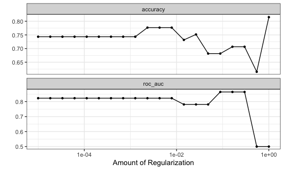
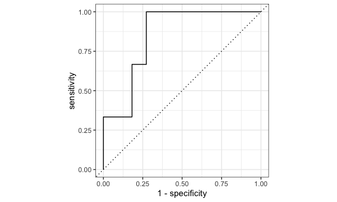
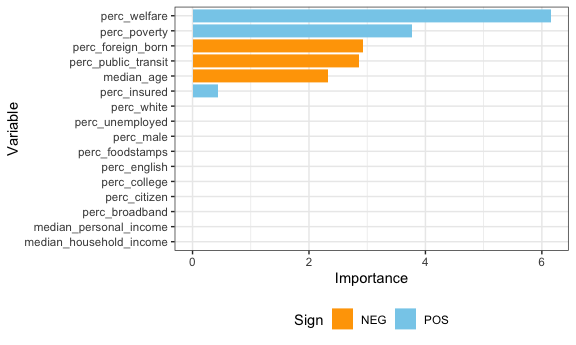
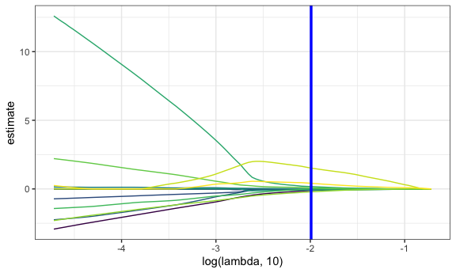
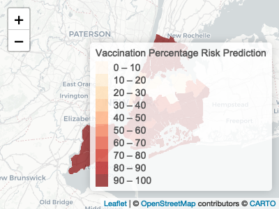

Prediction Modeling
================
Hun Lee
12/4/2021

# Data Preparation

``` r
# Example data frame with weightings for summary stats over each PUMA
nyc_puma_summary = cleaned_data %>% 
  # Note: do we need to filter to one individual per household for household weightings?
  group_by(puma) %>%
  summarize(
    total_people = sum(perwt),
    median_household_income = weighted.median(household_income, hhwt, na.rm = TRUE),
    perc_foodstamps = sum(hhwt[on_foodstamps == "Yes"]) * 100 / sum(hhwt),
    perc_broadband = sum(hhwt[has_broadband == "Yes"]) * 100 / sum(hhwt),
    perc_male = sum(perwt[sex == "Male"]) * 100 / sum(perwt),
    median_age = weighted.median(age, perwt, na.rm = TRUE),
    perc_white = sum(perwt[race == "White"]) * 100 / sum(perwt),
    perc_foreign_born = sum(perwt[birthplace == "Non-US"]) * 100 / sum(perwt),
    perc_citizen = sum(perwt[US_citizen == "Yes"]) * 100 / sum(perwt),
    perc_english = sum(perwt[language == "English"]) * 100 / sum(perwt),
    perc_college = sum(perwt[education %in% c("Some College", "Bachelor's Degree", "Post-Graduate Degree")]) * 100 / sum(perwt),
    perc_unemployed = sum(perwt[employment == "Unemployed"]) * 100 / sum(perwt),
    perc_insured = sum(perwt[health_insurance %in% c("Private", "Public")]) * 100 / sum(perwt),
    median_personal_income = weighted.median(personal_income, perwt, na.rm = TRUE),
    perc_welfare = sum(perwt[on_welfare == "Yes"]) * 100 / sum(perwt),
    perc_poverty = sum(perwt[poverty_threshold == "Below"]) * 100 / sum(perwt),
    perc_public_transit = sum(perwt[work_transport == "Public Transit"]) * 100 / sum(perwt),
    covid_hosp_rate = median(puma_hosp_rate),
    covid_vax_rate = median(puma_vacc_rate),
    covid_death_rate = median(puma_death_rate)
  )
```

## Prediction Modeling

### Risk scoring

We want to develop a method to score PUMAs on risk of not achieving herd
immunity from vaccination. Let’s say that herd immunity occurs at 70%
vaccination rate, for our purposes.

``` r
# Define binary outcome and set of predictors
# 1 indicates BELOW 70% vaccination rate
logistic_df = nyc_puma_summary %>% 
  mutate(
    below_herd_vax = as.factor(ifelse(covid_vax_rate >= 70, 0, 1))
  ) %>% 
  select(-puma, -total_people, -covid_hosp_rate, -covid_death_rate, -covid_vax_rate)

# Define predictors matrix
x = model.matrix(below_herd_vax ~ ., logistic_df)[,-1]

# Define outcomes
y = logistic_df$below_herd_vax
```

``` r
# Set seed for reproducibility
set.seed(1234)

# Split into training and testing data sets
# 41 rows in training
# 14 rows in testing
vax_split <- initial_split(logistic_df, strata = below_herd_vax)
vax_train <- training(vax_split)
vax_test <- testing(vax_split)

# Set another seed for reproducibility
set.seed(123)

# k-fold cross validation step repeated 30 times using stratification
vax_folds <- vfold_cv(vax_train, strata = below_herd_vax, v = 10, repeats = 1)
```

``` r
# Center and scale predictors
# Down-sample based on outcome
vax_rec <- recipe(below_herd_vax ~ ., data = vax_train) %>%
  step_normalize(all_numeric(), -all_outcomes()) %>%
  step_downsample(below_herd_vax)
```

``` r
# mixture = 1 & glmnet are for lasso regression
lasso_spec <- logistic_reg(penalty = tune(), mixture = 1) %>% 
  set_mode("classification") %>%
  set_engine("glmnet")

wf <- workflow(vax_rec, lasso_spec) 

# Search penalty over grid
vax_grid <- grid_regular(penalty(range = c(-5,0)), levels = 20) 
```

``` r
doParallel::registerDoParallel()
set.seed(2021)
# Compute a set of performance metrics for set of tuning parameters
vax_rs <-
  tune::tune_grid(
    wf,
    resamples = vax_folds,
    grid = vax_grid
  )
```

``` r
# Plot accuracy and ROC/AUC
autoplot(vax_rs)
```



``` r
# Identify best ROC/AUC
final_penalty <-
  vax_rs %>%
  select_best(metric = "roc_auc")

# Perform final model fit using optimal ROC/AUC
final_rs <-
  wf %>% 
  finalize_workflow(final_penalty) %>%
  last_fit(vax_split)

# Determine performance metrics on final binary classifier: ~79% accuracy
collect_metrics(final_rs)
```

    ## # A tibble: 2 × 4
    ##   .metric  .estimator .estimate .config             
    ##   <chr>    <chr>          <dbl> <chr>               
    ## 1 accuracy binary         0.786 Preprocessor1_Model1
    ## 2 roc_auc  binary         0.848 Preprocessor1_Model1

``` r
# Collect predictive performance metrics across splits
collect_predictions(final_rs)
```

    ## # A tibble: 14 × 7
    ##    id               .pred_0 .pred_1  .row .pred_class below_herd_vax .config    
    ##    <chr>              <dbl>   <dbl> <int> <fct>       <fct>          <chr>      
    ##  1 train/test split  0.362   0.638      1 1           1              Preprocess…
    ##  2 train/test split  0.0281  0.972      7 1           1              Preprocess…
    ##  3 train/test split  0.699   0.301     11 0           1              Preprocess…
    ##  4 train/test split  0.225   0.775     13 1           1              Preprocess…
    ##  5 train/test split  0.953   0.0474    17 0           0              Preprocess…
    ##  6 train/test split  0.478   0.522     21 1           1              Preprocess…
    ##  7 train/test split  0.214   0.786     23 1           1              Preprocess…
    ##  8 train/test split  0.373   0.627     27 1           1              Preprocess…
    ##  9 train/test split  0.366   0.634     29 1           1              Preprocess…
    ## 10 train/test split  0.603   0.397     33 0           1              Preprocess…
    ## 11 train/test split  0.611   0.389     36 0           1              Preprocess…
    ## 12 train/test split  0.489   0.511     39 1           1              Preprocess…
    ## 13 train/test split  0.555   0.445     48 0           0              Preprocess…
    ## 14 train/test split  0.608   0.392     52 0           0              Preprocess…

``` r
# Plot predictive performance measures across splits
collect_predictions(final_rs) %>%
  roc_curve(below_herd_vax, .pred_0) %>%
  autoplot()
```



``` r
# Extract most important variables for binary classification in final lasso model
wf %>% 
  finalize_workflow(final_penalty) %>%
  fit(vax_train) %>%
  extract_fit_parsnip() %>%
  vi() %>%
  mutate(Variable = fct_reorder(Variable, Importance)) %>%
  ggplot(aes(x = Importance, y = Variable, fill = Sign)) +
  geom_col() + 
  scale_fill_manual(values = c("orange", "skyblue"))
```



## Cross Validaiton Using Caret

``` r
library(caret)
library(mlbench)
```

## Repeated Cross Validation

``` r
set.seed(777)
vax_cv <- trainControl(method = "repeatedcv", number = 5, repeats = 100, 
                       savePredictions = T
                       )

# Goal is to find optimal lambda
lasso_model <- train(below_herd_vax ~ ., data = logistic_df,
                     method = "glmnet",
                     trControl = vax_cv,
                     tuneGrid = expand.grid(
                       .alpha = 1,
                       .lambda = seq(0.0001, 1, length = 100)),
                     family = "binomial")

lasso_model
```

    ## glmnet 
    ## 
    ## 55 samples
    ## 16 predictors
    ##  2 classes: '0', '1' 
    ## 
    ## No pre-processing
    ## Resampling: Cross-Validated (5 fold, repeated 100 times) 
    ## Summary of sample sizes: 44, 44, 44, 44, 44, 44, ... 
    ## Resampling results across tuning parameters:
    ## 
    ##   lambda  Accuracy   Kappa        
    ##   0.0001  0.8350030   0.5069007776
    ##   0.0102  0.8864303   0.6103143908
    ##   0.0203  0.8813212   0.5595070063
    ##   0.0304  0.8753758   0.5143561440
    ##   0.0405  0.8641152   0.4434275908
    ##   0.0506  0.8473879   0.3506936131
    ##   0.0607  0.8278273   0.2375886941
    ##   0.0708  0.8105848   0.1347184120
    ##   0.0809  0.7995394   0.0689040837
    ##   0.0910  0.7957758   0.0395333694
    ##   0.1011  0.7935727   0.0196021570
    ##   0.1112  0.7932697   0.0089344023
    ##   0.1213  0.7938606   0.0008179452
    ##   0.1314  0.7956364  -0.0015992933
    ##   0.1415  0.7954879  -0.0066111743
    ##   0.1516  0.7990818  -0.0008349543
    ##   0.1617  0.7996455  -0.0017188329
    ##   0.1718  0.8003909  -0.0005835544
    ##   0.1819  0.8007727   0.0000000000
    ##   0.1920  0.8007727   0.0000000000
    ##   0.2021  0.8007727   0.0000000000
    ##   0.2122  0.8007727   0.0000000000
    ##   0.2223  0.8007727   0.0000000000
    ##   0.2324  0.8007727   0.0000000000
    ##   0.2425  0.8007727   0.0000000000
    ##   0.2526  0.8007727   0.0000000000
    ##   0.2627  0.8007727   0.0000000000
    ##   0.2728  0.8007727   0.0000000000
    ##   0.2829  0.8007727   0.0000000000
    ##   0.2930  0.8007727   0.0000000000
    ##   0.3031  0.8007727   0.0000000000
    ##   0.3132  0.8007727   0.0000000000
    ##   0.3233  0.8007727   0.0000000000
    ##   0.3334  0.8007727   0.0000000000
    ##   0.3435  0.8007727   0.0000000000
    ##   0.3536  0.8007727   0.0000000000
    ##   0.3637  0.8007727   0.0000000000
    ##   0.3738  0.8007727   0.0000000000
    ##   0.3839  0.8007727   0.0000000000
    ##   0.3940  0.8007727   0.0000000000
    ##   0.4041  0.8007727   0.0000000000
    ##   0.4142  0.8007727   0.0000000000
    ##   0.4243  0.8007727   0.0000000000
    ##   0.4344  0.8007727   0.0000000000
    ##   0.4445  0.8007727   0.0000000000
    ##   0.4546  0.8007727   0.0000000000
    ##   0.4647  0.8007727   0.0000000000
    ##   0.4748  0.8007727   0.0000000000
    ##   0.4849  0.8007727   0.0000000000
    ##   0.4950  0.8007727   0.0000000000
    ##   0.5051  0.8007727   0.0000000000
    ##   0.5152  0.8007727   0.0000000000
    ##   0.5253  0.8007727   0.0000000000
    ##   0.5354  0.8007727   0.0000000000
    ##   0.5455  0.8007727   0.0000000000
    ##   0.5556  0.8007727   0.0000000000
    ##   0.5657  0.8007727   0.0000000000
    ##   0.5758  0.8007727   0.0000000000
    ##   0.5859  0.8007727   0.0000000000
    ##   0.5960  0.8007727   0.0000000000
    ##   0.6061  0.8007727   0.0000000000
    ##   0.6162  0.8007727   0.0000000000
    ##   0.6263  0.8007727   0.0000000000
    ##   0.6364  0.8007727   0.0000000000
    ##   0.6465  0.8007727   0.0000000000
    ##   0.6566  0.8007727   0.0000000000
    ##   0.6667  0.8007727   0.0000000000
    ##   0.6768  0.8007727   0.0000000000
    ##   0.6869  0.8007727   0.0000000000
    ##   0.6970  0.8007727   0.0000000000
    ##   0.7071  0.8007727   0.0000000000
    ##   0.7172  0.8007727   0.0000000000
    ##   0.7273  0.8007727   0.0000000000
    ##   0.7374  0.8007727   0.0000000000
    ##   0.7475  0.8007727   0.0000000000
    ##   0.7576  0.8007727   0.0000000000
    ##   0.7677  0.8007727   0.0000000000
    ##   0.7778  0.8007727   0.0000000000
    ##   0.7879  0.8007727   0.0000000000
    ##   0.7980  0.8007727   0.0000000000
    ##   0.8081  0.8007727   0.0000000000
    ##   0.8182  0.8007727   0.0000000000
    ##   0.8283  0.8007727   0.0000000000
    ##   0.8384  0.8007727   0.0000000000
    ##   0.8485  0.8007727   0.0000000000
    ##   0.8586  0.8007727   0.0000000000
    ##   0.8687  0.8007727   0.0000000000
    ##   0.8788  0.8007727   0.0000000000
    ##   0.8889  0.8007727   0.0000000000
    ##   0.8990  0.8007727   0.0000000000
    ##   0.9091  0.8007727   0.0000000000
    ##   0.9192  0.8007727   0.0000000000
    ##   0.9293  0.8007727   0.0000000000
    ##   0.9394  0.8007727   0.0000000000
    ##   0.9495  0.8007727   0.0000000000
    ##   0.9596  0.8007727   0.0000000000
    ##   0.9697  0.8007727   0.0000000000
    ##   0.9798  0.8007727   0.0000000000
    ##   0.9899  0.8007727   0.0000000000
    ##   1.0000  0.8007727   0.0000000000
    ## 
    ## Tuning parameter 'alpha' was held constant at a value of 1
    ## Accuracy was used to select the optimal model using the largest value.
    ## The final values used for the model were alpha = 1 and lambda = 0.0102.

## Result from training data

``` r
coef <- coef(lasso_model$finalModel, lasso_model$bestTune$lambda)

sub_lasso <-
  subset(lasso_model$pred, lasso_model$pred$lambda == lasso_model$bestTune$lambda)

caret::confusionMatrix(table(sub_lasso$pred, sub_lasso$obs))
```

    ## Confusion Matrix and Statistics
    ## 
    ##    
    ##        0    1
    ##   0  732  258
    ##   1  368 4142
    ##                                           
    ##                Accuracy : 0.8862          
    ##                  95% CI : (0.8775, 0.8945)
    ##     No Information Rate : 0.8             
    ##     P-Value [Acc > NIR] : < 2.2e-16       
    ##                                           
    ##                   Kappa : 0.6305          
    ##                                           
    ##  Mcnemar's Test P-Value : 1.321e-05       
    ##                                           
    ##             Sensitivity : 0.6655          
    ##             Specificity : 0.9414          
    ##          Pos Pred Value : 0.7394          
    ##          Neg Pred Value : 0.9184          
    ##              Prevalence : 0.2000          
    ##          Detection Rate : 0.1331          
    ##    Detection Prevalence : 0.1800          
    ##       Balanced Accuracy : 0.8034          
    ##                                           
    ##        'Positive' Class : 0               
    ## 

``` r
#lambda <- 10^seq(-2, 3, length = 0.1)

lambda  <- seq(0.0001, 1, length = 100)

lambda_opt = lasso_model$bestTune$lambda


broom::tidy(lasso_model$finalModel) %>% 
select(term, lambda, estimate) %>% 
complete(term, lambda, fill = list(estimate = 0) ) %>% 
filter(term != "(Intercept)") %>% 
ggplot(aes(x = log(lambda, 10), y = estimate, group = term, color = term)) + 
geom_path() + 
geom_vline(xintercept = log(lambda_opt, 10), color = "blue", size = 1.2) +
theme(legend.position = "none")
```



## Getting Risk Prediction for each puma

``` r
lambda <- lasso_model$bestTune$lambda
lasso_fit = glmnet(x, y, lambda = lambda, family = "binomial")
risk_predictions = (round((predict(lasso_fit, x, type = "response"))*100, 1))


puma <- nyc_puma_summary %>% 
  select(puma)

vax <- logistic_df %>% 
  select(below_herd_vax)


risk_prediction <- 
  bind_cols(puma, vax, as.vector(risk_predictions)) %>%
  rename(risk_prediciton = ...3)

risk_prediction
```

    ## # A tibble: 55 × 3
    ##    puma  below_herd_vax risk_prediciton
    ##    <fct> <fct>                    <dbl>
    ##  1 3701  1                         99.6
    ##  2 3702  1                        100  
    ##  3 3703  1                         99.6
    ##  4 3704  1                         99.8
    ##  5 3705  1                        100  
    ##  6 3706  1                        100  
    ##  7 3707  1                        100  
    ##  8 3708  1                        100  
    ##  9 3709  1                        100  
    ## 10 3710  1                        100  
    ## # … with 45 more rows

``` r
library(nycgeo)
library(sf)
library(leaflet)
library(htmlwidgets)
library(shiny)
library(stringi)

nyc_hh_summary <- read_csv("./data_for_regression.csv")

risk_prediction_map_data <-
  nyc_boundaries(geography = "puma") %>%
  mutate(puma = puma_id) %>%
  left_join(risk_prediction, by = "puma") 
```

``` r
map_dataset <-
  risk_prediction_map_data %>%
  merge(nyc_hh_summary, by = "puma") %>%
  mutate(median_household_income = round(median_household_income, digits = 0),
         perc_insured = round(perc_insured, digits = 1),
         perc_unemployed = round(perc_unemployed, digits = 1),
         perc_poverty = round(perc_poverty, digits = 1)
         ) %>% 
  mutate(median_household_income = 
           formatC(median_household_income,format = "d",big.mark = ",")) %>%
  mutate(covid_vacc_rate = round(covid_vacc_rate, digits = 1),
         covid_death_rate_2020 = round(covid_death_rate_2020, digits = 0),
         covid_death_rate_2021 = round(covid_death_rate_2021, digits = 0),
         covid_hosp_rate_2020 = round(covid_hosp_rate_2020, digits = 0),
         covid_hosp_rate_2021 = round(covid_hosp_rate_2021, digits = 0)
         ) 
```

``` r
map_dataset_label <-
  map_dataset %>% 
  select(puma, perc_asian, perc_white, perc_black, perc_hispanic, perc_other) %>%
  pivot_longer(perc_asian:perc_other, values_to = "value", names_to = "race") %>%
  arrange(puma, desc(value)) %>% 
  mutate(race = recode(race, 
                       "perc_asian" = "Asian/Pacific Islander:",
                       "perc_white" = "White:",
                       "perc_black" = "Black:",
                       "perc_hispanic" = "Hispanic:",
                       "perc_other" = "Other:",
                       )) %>%
  mutate(value = round(value, digits = 1)) %>%
  mutate(label = paste(race, value)) %>%
  mutate(label = paste0(label, "%")) %>%
  select(puma, label)

first_race <-
  map_dataset_label %>% 
  group_by(puma) %>% 
  filter(row_number() == 1) %>%
  mutate(label1 = label) %>%
  select(puma, label1)

second_race <-
  map_dataset_label %>% 
  group_by(puma) %>% 
  filter(row_number() == 2) %>%
  mutate(label2 = label) %>%
  select(puma, label2)

third_race <-
map_dataset_label %>% 
  group_by(puma) %>% 
  filter(row_number() == 3) %>%
  mutate(label3 = label) %>%
  select(puma, label3)

fourth_race <-
map_dataset_label %>% 
  group_by(puma) %>% 
  filter(row_number() == 4) %>%
  mutate(label4 = label) %>%
  select(puma, label4)

fifth_race <-
map_dataset_label %>% 
  group_by(puma) %>% 
  filter(row_number() == 5) %>%
  mutate(label5 = label) %>%
  select(puma, label5)

map_dataset_label <-
  bind_cols(first_race, second_race, third_race, fourth_race, fifth_race)
```

``` r
labels <- sprintf("<strong>%s<strong> <br/> %s <br/> %s <br/> %s <br/> %s <br/> %s <br/>
                  Insurance Rate: %s%% <br/> Median Household Income: $%s <br/> Vaccination
                  Risk Score: %g%%", map_dataset$puma_name, map_dataset_label$label1,
                  map_dataset_label$label2, map_dataset_label$label3,
                  map_dataset_label$label4, map_dataset_label$label5,
                  map_dataset$perc_insured, map_dataset$median_household_income,
                  map_dataset$risk_prediciton) %>% lapply(htmltools::HTML)

pal <- colorBin(palette = "OrRd", 9, domain = map_dataset$risk_prediciton)

map_interactive <- map_dataset %>% st_transform(crs = "+init=epsg:4326") %>%
  leaflet() %>%
  addProviderTiles(provider = "CartoDB.Positron") %>%
  addPolygons(label = labels,
              labelOptions = labelOptions(
    style = list("font-weight" = "normal", 
                 padding = "1px 2px"),
    textsize = "11px",  sticky = TRUE,
    opacity = 0.55
    ),
              stroke = FALSE,
              opacity = 0.01,
              smoothFactor = .5,
              fillOpacity = 0.7,
              fillColor = ~pal(risk_prediciton),
              highlightOptions = highlightOptions(weight = 5, 
                                                  fillOpacity = 1,
                                                  color = "black",
                                                  opacity = 1,
                                                  bringToFront = TRUE
                                                  )) %>%
  addLegend("bottomright",
            pal = pal,
            values = ~risk_prediciton,
            title = "Vaccination Percentage Risk Prediction",
            opacity = 0.7
            )
```

    ## Warning in CPL_crs_from_input(x): GDAL Message 1: +init=epsg:XXXX syntax is
    ## deprecated. It might return a CRS with a non-EPSG compliant axis order.

    ## Warning in RColorBrewer::brewer.pal(max(3, n), palette): n too large, allowed maximum for palette OrRd is 9
    ## Returning the palette you asked for with that many colors

    ## Warning in RColorBrewer::brewer.pal(max(3, n), palette): n too large, allowed maximum for palette OrRd is 9
    ## Returning the palette you asked for with that many colors

``` r
map_interactive
```


