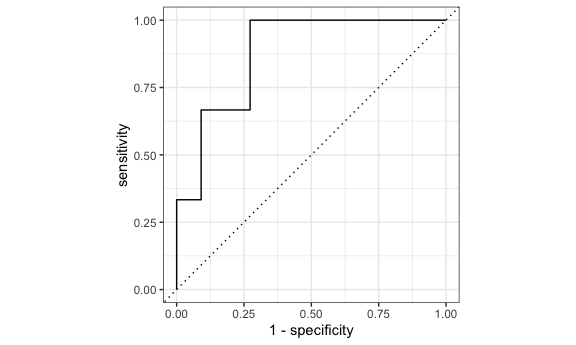

Prediction Modeling
================
Hun Lee
12/4/2021

# Data Preparation

``` r
# Example data frame with weightings for summary stats over each PUMA
nyc_puma_summary = cleaned_data %>% 
  # Note: do we need to filter to one individual per household for household weightings?
  group_by(puma) %>%
  summarize(
    total_people = sum(perwt),
    median_household_income = weighted.median(household_income, hhwt, na.rm = TRUE),
    perc_foodstamps = sum(hhwt[on_foodstamps == "Yes"]) * 100 / sum(hhwt),
    perc_broadband = sum(hhwt[has_broadband == "Yes"]) * 100 / sum(hhwt),
    perc_male = sum(perwt[sex == "Male"]) * 100 / sum(perwt),
    median_age = weighted.median(age, perwt, na.rm = TRUE),
    perc_white = sum(perwt[race == "White"]) * 100 / sum(perwt),
    perc_foreign_born = sum(perwt[birthplace == "Non-US"]) * 100 / sum(perwt),
    perc_citizen = sum(perwt[US_citizen == "Yes"]) * 100 / sum(perwt),
    perc_english = sum(perwt[language == "English"]) * 100 / sum(perwt),
    perc_college = sum(perwt[education %in% c("Some College", "Bachelor's Degree", "Post-Graduate Degree")]) * 100 / sum(perwt),
    perc_unemployed = sum(perwt[employment == "Unemployed"]) * 100 / sum(perwt),
    perc_insured = sum(perwt[health_insurance %in% c("Private", "Public")]) * 100 / sum(perwt),
    median_personal_income = weighted.median(personal_income, perwt, na.rm = TRUE),
    perc_welfare = sum(perwt[on_welfare == "Yes"]) * 100 / sum(perwt),
    perc_poverty = sum(perwt[poverty_threshold == "Below"]) * 100 / sum(perwt),
    perc_public_transit = sum(perwt[work_transport == "Public Transit"]) * 100 / sum(perwt),
    covid_hosp_rate = median(puma_hosp_rate),
    covid_vax_rate = median(puma_vacc_rate),
    covid_death_rate = median(puma_death_rate)
  )
```

## Prediction Modeling

### Risk scoring

We want to develop a method to score PUMAs on risk of not achieving herd
immunity from vaccination. Let’s say that herd immunity occurs at 70%
vaccination rate, for our purposes.

``` r
# Define binary outcome and set of predictors
# 1 indicates BELOW 70% vaccination rate
logistic_df = nyc_puma_summary %>% 
  mutate(
    below_herd_vax = as.factor(ifelse(covid_vax_rate >= 70, 0, 1))
  ) %>% 
  select(-puma, -total_people, -covid_hosp_rate, -covid_death_rate, -covid_vax_rate)

# Define predictors matrix
x = model.matrix(below_herd_vax ~ ., logistic_df)[,-1]

# Define outcomes
y = logistic_df$below_herd_vax
```

``` r
# Set seed for reproducibility
set.seed(1234)

# Split into training and testing data sets
# 41 rows in training
# 14 rows in testing
vax_split <- initial_split(logistic_df, strata = below_herd_vax)
vax_train <- training(vax_split)
vax_test <- testing(vax_split)

# Set another seed for reproducibility
set.seed(123)

# k-fold cross validation step repeated 30 times using stratification
vax_folds <- vfold_cv(vax_train, strata = below_herd_vax, v = 10, repeats = 30)
```

``` r
# Center and scale predictors
# Down-sample based on outcome
vax_rec <- recipe(below_herd_vax ~ ., data = vax_train) %>%
  step_normalize(all_numeric(), -all_outcomes()) %>%
  step_downsample(below_herd_vax)
```

``` r
# mixture = 1 & glmnet are for lasso regression
lasso_spec <- logistic_reg(penalty = tune(), mixture = 1) %>% 
  set_mode("classification") %>%
  set_engine("glmnet")

wf <- workflow(vax_rec, lasso_spec) 

# Search penalty over grid
vax_grid <- grid_regular(penalty(range = c(-5,0)), levels = 20) 
```

``` r
doParallel::registerDoParallel()
set.seed(2021)
# Compute a set of performance metrics for set of tuning parameters
vax_rs <-
  tune::tune_grid(
    wf,
    resamples = vax_folds,
    grid = vax_grid
  )
```

``` r
# Plot accuracy and ROC/AUC
autoplot(vax_rs)
```


``` r
# Identify best ROC/AUC
final_penalty <-
  vax_rs %>%
  select_best(metric = "roc_auc")

# Perform final model fit using optimal ROC/AUC
final_rs <-
  wf %>% 
  finalize_workflow(final_penalty) %>%
  last_fit(vax_split)

# Determine performance metrics on final binary classifier: ~79% accuracy
collect_metrics(final_rs)
```

    ## # A tibble: 2 × 4
    ##   .metric  .estimator .estimate .config             
    ##   <chr>    <chr>          <dbl> <chr>               
    ## 1 accuracy binary         0.786 Preprocessor1_Model1
    ## 2 roc_auc  binary         0.879 Preprocessor1_Model1

``` r
# Collect predictive performance metrics across splits
collect_predictions(final_rs)
```

    ## # A tibble: 14 × 7
    ##    id                .pred_0 .pred_1  .row .pred_class below_herd_vax .config   
    ##    <chr>               <dbl>   <dbl> <int> <fct>       <fct>          <chr>     
    ##  1 train/test split 1.36e- 3 0.999       1 1           1              Preproces…
    ##  2 train/test split 1.90e-11 1.00        7 1           1              Preproces…
    ##  3 train/test split 4.22e- 5 1.00       11 1           1              Preproces…
    ##  4 train/test split 2.82e- 5 1.00       13 1           1              Preproces…
    ##  5 train/test split 2.63e- 1 0.737      17 1           0              Preproces…
    ##  6 train/test split 2.53e- 1 0.747      21 1           1              Preproces…
    ##  7 train/test split 1.74e- 2 0.983      23 1           1              Preproces…
    ##  8 train/test split 1.97e- 2 0.980      27 1           1              Preproces…
    ##  9 train/test split 4.61e- 2 0.954      29 1           1              Preproces…
    ## 10 train/test split 5.12e- 1 0.488      33 0           1              Preproces…
    ## 11 train/test split 1.93e- 1 0.807      36 1           1              Preproces…
    ## 12 train/test split 6.90e- 2 0.931      39 1           1              Preproces…
    ## 13 train/test split 9.91e- 1 0.00883    48 0           0              Preproces…
    ## 14 train/test split 7.06e- 2 0.929      52 1           0              Preproces…

``` r
# Plot predictive performance measures across splits
collect_predictions(final_rs) %>%
  roc_curve(below_herd_vax, .pred_0) %>%
  autoplot()
```



``` r
# Extract most important variables for binary classification in final lasso model
wf %>% 
  finalize_workflow(final_penalty) %>%
  fit(vax_train) %>%
  extract_fit_parsnip() %>%
  vi() %>%
  mutate(Variable = fct_reorder(Variable, Importance)) %>%
  ggplot(aes(x = Importance, y = Variable, fill = Sign)) +
  geom_col() + 
  scale_fill_manual(values = c("orange", "skyblue"))
```


## Cross Validaiton Using Caret

``` r
library(caret)
library(mlbench)
```

## Repeated Cross Validation

``` r
set.seed(777)
vax_cv <- trainControl(method = "repeatedcv", number = 5, repeats = 100, 
                       savePredictions = T
                       )

lasso_model <- train(below_herd_vax ~ ., data = logistic_df,
                     method = "glmnet",
                     trControl = vax_cv,
                     tuneGrid = expand.grid(
                       .alpha = 1,
                       .lambda = 10^seq(-5, 5, length = 10)),
                     family = "binomial")

lasso_model
```

    ## glmnet 
    ## 
    ## 55 samples
    ## 16 predictors
    ##  2 classes: '0', '1' 
    ## 
    ## No pre-processing
    ## Resampling: Cross-Validated (5 fold, repeated 100 times) 
    ## Summary of sample sizes: 44, 44, 44, 44, 44, 44, ... 
    ## Resampling results across tuning parameters:
    ## 
    ##   lambda        Accuracy   Kappa    
    ##   1.000000e-05  0.8335121  0.5056866
    ##   1.291550e-04  0.8351667  0.5076780
    ##   1.668101e-03  0.8449424  0.5295549
    ##   2.154435e-02  0.8807242  0.5557529
    ##   2.782559e-01  0.8007727  0.0000000
    ##   3.593814e+00  0.8007727  0.0000000
    ##   4.641589e+01  0.8007727  0.0000000
    ##   5.994843e+02  0.8007727  0.0000000
    ##   7.742637e+03  0.8007727  0.0000000
    ##   1.000000e+05  0.8007727  0.0000000
    ## 
    ## Tuning parameter 'alpha' was held constant at a value of 1
    ## Accuracy was used to select the optimal model using the largest value.
    ## The final values used for the model were alpha = 1 and lambda = 0.02154435.

## Result

``` r
coef <- coef(lasso_model$finalModel, lasso_model$bestTune$lambda)

sub_lasso <-
  subset(lasso_model$pred, lasso_model$pred$lambda == lasso_model$bestTune$lambda)

caret::confusionMatrix(table(sub_lasso$pred, sub_lasso$obs))
```

    ## Confusion Matrix and Statistics
    ## 
    ##    
    ##        0    1
    ##   0  638  195
    ##   1  462 4205
    ##                                          
    ##                Accuracy : 0.8805         
    ##                  95% CI : (0.8717, 0.889)
    ##     No Information Rate : 0.8            
    ##     P-Value [Acc > NIR] : < 2.2e-16      
    ##                                          
    ##                   Kappa : 0.5893         
    ##                                          
    ##  Mcnemar's Test P-Value : < 2.2e-16      
    ##                                          
    ##             Sensitivity : 0.5800         
    ##             Specificity : 0.9557         
    ##          Pos Pred Value : 0.7659         
    ##          Neg Pred Value : 0.9010         
    ##              Prevalence : 0.2000         
    ##          Detection Rate : 0.1160         
    ##    Detection Prevalence : 0.1515         
    ##       Balanced Accuracy : 0.7678         
    ##                                          
    ##        'Positive' Class : 0              
    ## 

## Getting Risk Prediction for each puma

``` r
lambda <- lasso_model$bestTune$lambda
lasso_fit = glmnet(x, y, lambda = lambda, family = "binomial")
risk_predictions = (round((predict(lasso_fit, x, type = "response"))*100, 1))


puma <- nyc_puma_summary %>% 
  select(puma)

vax <- logistic_df %>% 
  select(below_herd_vax)


bind_cols(puma, vax, as.vector(risk_predictions)) %>%
  rename(risk_prediciton = ...3)
```

    ## # A tibble: 55 × 3
    ##    puma  below_herd_vax risk_prediciton
    ##    <fct> <fct>                    <dbl>
    ##  1 3701  1                         98.2
    ##  2 3702  1                         99.7
    ##  3 3703  1                         99  
    ##  4 3704  1                         99  
    ##  5 3705  1                        100  
    ##  6 3706  1                         99.8
    ##  7 3707  1                        100  
    ##  8 3708  1                         99.7
    ##  9 3709  1                         99.7
    ## 10 3710  1                        100  
    ## # … with 45 more rows

======= \#\# ZK additions

Open questions:

1.  Beyond the final binary classification as 1 or 0 for each PUMA, is
    there a way to determine the probability of it being a 1 or 0? The
    way the classifier works, for example, is that if p(outcome == 1)
    &gt; 0.5, it classifies it as 1, otherwise as 0 on the predicted
    outcome. But is there a way to extract the exact probabilities
    calculated, like 0.76, 0.24, 0.31, etc, for each predicted data
    point? This we can just use as a “risk score” out of 100.

2.  Given that we have imbalanced classes for the outcome — 44 data
    points vs 11 data points are above or below, rather than 50/50, we
    should not use accuracy as an appropriate measure for our
    classifier, since the probability of guessing “correctly” for any
    single data point is 0.8 (44 out of 55), not 0.5. I believe we
    should instead use AUC or kappa. Accuracy would really only
    represent the underlying class distribution more than anything. For
    instance, the reason we get 80% accuracy on an imbalanced data (with
    80% of the instances as 1’s and 20% as 0’s) is because our models
    look at the data and cleverly decide that the best thing to do is to
    always predict 1 to achieve high accuracy.

The literature says instead to use precision, recall, F1/F score, kappa,
and/or ROC curves, so let’s try that.

``` r
predicted_vs_actual = final_rs %>% 
  unnest(.predictions) %>% 
  select(.pred_class, below_herd_vax)

# Add confusion matrix
caret::confusionMatrix(data = factor(predicted_vs_actual$.pred_class), reference = factor(predicted_vs_actual$below_herd_vax))
```

    ## Confusion Matrix and Statistics
    ## 
    ##           Reference
    ## Prediction  0  1
    ##          0  1  1
    ##          1  2 10
    ##                                          
    ##                Accuracy : 0.7857         
    ##                  95% CI : (0.492, 0.9534)
    ##     No Information Rate : 0.7857         
    ##     P-Value [Acc > NIR] : 0.6483         
    ##                                          
    ##                   Kappa : 0.2759         
    ##                                          
    ##  Mcnemar's Test P-Value : 1.0000         
    ##                                          
    ##             Sensitivity : 0.33333        
    ##             Specificity : 0.90909        
    ##          Pos Pred Value : 0.50000        
    ##          Neg Pred Value : 0.83333        
    ##              Prevalence : 0.21429        
    ##          Detection Rate : 0.07143        
    ##    Detection Prevalence : 0.14286        
    ##       Balanced Accuracy : 0.62121        
    ##                                          
    ##        'Positive' Class : 0              
    ## 

Our kappa value is 0.28. This is a measure of “how closely the instances
classified by the machine learning classifier matched the data labeled
as ground truth, controlling for the accuracy of a random classifier as
measured by the expected accuracy.” According to Landis and Koch, this
is a “fair” or “poor” kappa statistic.
