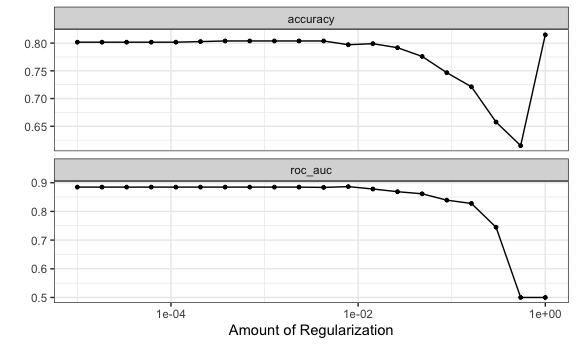
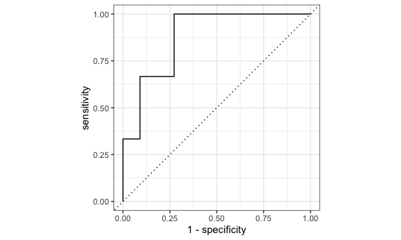
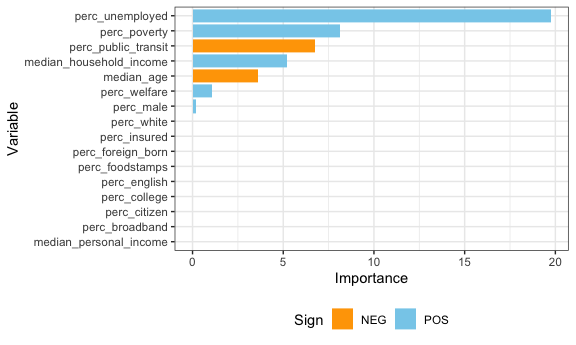

Prediction Modeling
================
Hun Lee
12/4/2021

# Data Preparation

``` r
# Example data frame with weightings for summary stats over each PUMA
nyc_puma_summary = cleaned_data %>% 
  # Note: do we need to filter to one individual per household for household weightings?
  group_by(puma) %>%
  summarize(
    total_people = sum(perwt),
    median_household_income = weighted.median(household_income, hhwt, na.rm = TRUE),
    perc_foodstamps = sum(hhwt[on_foodstamps == "Yes"]) * 100 / sum(hhwt),
    perc_broadband = sum(hhwt[has_broadband == "Yes"]) * 100 / sum(hhwt),
    perc_male = sum(perwt[sex == "Male"]) * 100 / sum(perwt),
    median_age = weighted.median(age, perwt, na.rm = TRUE),
    perc_white = sum(perwt[race == "White"]) * 100 / sum(perwt),
    perc_foreign_born = sum(perwt[birthplace == "Non-US"]) * 100 / sum(perwt),
    perc_citizen = sum(perwt[US_citizen == "Yes"]) * 100 / sum(perwt),
    perc_english = sum(perwt[language == "English"]) * 100 / sum(perwt),
    perc_college = sum(perwt[education %in% c("Some College", "Bachelor's Degree", "Post-Graduate Degree")]) * 100 / sum(perwt),
    perc_unemployed = sum(perwt[employment == "Unemployed"]) * 100 / sum(perwt),
    perc_insured = sum(perwt[health_insurance %in% c("Private", "Public")]) * 100 / sum(perwt),
    median_personal_income = weighted.median(personal_income, perwt, na.rm = TRUE),
    perc_welfare = sum(perwt[on_welfare == "Yes"]) * 100 / sum(perwt),
    perc_poverty = sum(perwt[poverty_threshold == "Below"]) * 100 / sum(perwt),
    perc_public_transit = sum(perwt[work_transport == "Public Transit"]) * 100 / sum(perwt),
    covid_hosp_rate = median(puma_hosp_rate),
    covid_vax_rate = median(puma_vacc_rate),
    covid_death_rate = median(puma_death_rate)
  )
```

## Prediction Modeling

### Risk scoring

We want to develop a method to score PUMAs on risk of not achieving herd
immunity from vaccination. Let’s say that herd immunity occurs at 70%
vaccination rate, for our purposes.

``` r
# Define binary outcome and set of predictors
# 1 indicates BELOW 70% vaccination rate
logistic_df = nyc_puma_summary %>% 
  mutate(
    below_herd_vax = as.factor(ifelse(covid_vax_rate >= 70, 0, 1))
  ) %>% 
  select(-puma, -total_people, -covid_hosp_rate, -covid_death_rate, -covid_vax_rate)
# Define predictors and outcome
x = model.matrix(below_herd_vax ~ ., logistic_df)[,-1]
y = logistic_df$below_herd_vax
```

``` r
set.seed(1234)
vax_split <- initial_split(logistic_df, strata = below_herd_vax)
vax_train <- training(vax_split)
vax_test <- testing(vax_split)


set.seed(123)
vax_folds <- vfold_cv(vax_train, strata = below_herd_vax, v = 10, repeats = 30)
```

``` r
library(themis)

vax_rec <- recipe(below_herd_vax ~ ., data = vax_train) %>%
  step_normalize(all_numeric(), -all_outcomes()) %>%
  step_downsample(below_herd_vax)
```

``` r
# mixture = 1 & glmnet are for lasso regression
lasso_spec <- logistic_reg(penalty = tune(), mixture = 1) %>% 
  set_mode("classification") %>%
  set_engine("glmnet")

wf <- workflow(vax_rec, lasso_spec) 

vax_grid <- grid_regular(penalty(range = c(-5,0)), levels = 20) 
```

``` r
doParallel::registerDoParallel()
set.seed(2021)
vax_rs <-
  tune_grid(
    wf,
    resamples = vax_folds,
    grid = vax_grid
  )
```

``` r
autoplot(vax_rs)
```



``` r
final_penalty <-
  vax_rs %>%
  select_best(metric ="roc_auc")

final_rs <-
  wf %>% 
  finalize_workflow(final_penalty) %>%
  last_fit(vax_split)


collect_metrics(final_rs)
```

    ## # A tibble: 2 × 4
    ##   .metric  .estimator .estimate .config             
    ##   <chr>    <chr>          <dbl> <chr>               
    ## 1 accuracy binary         0.786 Preprocessor1_Model1
    ## 2 roc_auc  binary         0.879 Preprocessor1_Model1

``` r
collect_predictions(final_rs)
```

    ## # A tibble: 14 × 7
    ##    id                .pred_0 .pred_1  .row .pred_class below_herd_vax .config   
    ##    <chr>               <dbl>   <dbl> <int> <fct>       <fct>          <chr>     
    ##  1 train/test split 1.36e- 3 0.999       1 1           1              Preproces…
    ##  2 train/test split 1.90e-11 1.00        7 1           1              Preproces…
    ##  3 train/test split 4.22e- 5 1.00       11 1           1              Preproces…
    ##  4 train/test split 2.82e- 5 1.00       13 1           1              Preproces…
    ##  5 train/test split 2.63e- 1 0.737      17 1           0              Preproces…
    ##  6 train/test split 2.53e- 1 0.747      21 1           1              Preproces…
    ##  7 train/test split 1.74e- 2 0.983      23 1           1              Preproces…
    ##  8 train/test split 1.97e- 2 0.980      27 1           1              Preproces…
    ##  9 train/test split 4.61e- 2 0.954      29 1           1              Preproces…
    ## 10 train/test split 5.12e- 1 0.488      33 0           1              Preproces…
    ## 11 train/test split 1.93e- 1 0.807      36 1           1              Preproces…
    ## 12 train/test split 6.90e- 2 0.931      39 1           1              Preproces…
    ## 13 train/test split 9.91e- 1 0.00883    48 0           0              Preproces…
    ## 14 train/test split 7.06e- 2 0.929      52 1           0              Preproces…

``` r
collect_metrics(final_rs)
```

    ## # A tibble: 2 × 4
    ##   .metric  .estimator .estimate .config             
    ##   <chr>    <chr>          <dbl> <chr>               
    ## 1 accuracy binary         0.786 Preprocessor1_Model1
    ## 2 roc_auc  binary         0.879 Preprocessor1_Model1

``` r
collect_predictions(final_rs) %>%
  roc_curve(below_herd_vax, .pred_0) %>%
  autoplot()
```



``` r
library(vip)

wf %>% 
finalize_workflow(final_penalty) %>%
fit(vax_train) %>%
pull_workflow_fit() %>%
vi() %>%
mutate(Variable = fct_reorder(Variable, Importance)) %>%
ggplot(aes(x = Importance, y = Variable, fill = Sign)) +
geom_col() + 
scale_fill_manual(values = c("orange", "skyblue"))
```

    ## Warning: `pull_workflow_fit()` was deprecated in workflows 0.2.3.
    ## Please use `extract_fit_parsnip()` instead.


