Initial Exploratory Analysis
================
Zachary Katz
11/24/2021

<!------------------------------------------------------------------------------
Preamble
------------------------------------------------------------------------------->
<!------------------------------------------------------------------------------
Overview
------------------------------------------------------------------------------->

# Unzipping the Census Data

``` r
jimzip <- function(csv_file, path) {
  # create full path to csv file
  full_csv <- paste0(path, "/", csv_file)
  # append ".zip" to csv file
  zip_file <- paste0(full_csv, ".zip")
  # unzip file
  unzip(zip_file)
  # read csv
  data_extract <- read_csv(csv_file)
  # be sure to remove file once unzipped (it will live in working directory)
  on.exit(file.remove(csv_file))
  # output data
  data_extract
}

census_data <- jimzip("census_filtered.csv", "./data")
head(census_data) %>%  knitr::kable()
```

| multyear |  serial | hhwt |      cluster | countyfip | puma | strata | rent | hhincome | foodstmp | cihispeed | perwt | famsize | nchild | sex | age | race | hispan | bpl | ancestr1 | ancestr2 | citizen | yrsusa1 | language | hcovany | hcovpriv | hcovpub | educd | empstat | labforce |  occ |  ind |  inctot | ftotinc | incwage | incwelfr | poverty | occscore | pwpuma00 | tranwork |
|---------:|--------:|-----:|-------------:|----------:|-----:|-------:|-----:|---------:|---------:|----------:|------:|--------:|-------:|----:|----:|-----:|-------:|----:|---------:|---------:|--------:|--------:|---------:|--------:|---------:|--------:|------:|--------:|---------:|-----:|-----:|--------:|--------:|--------:|---------:|--------:|---------:|---------:|---------:|
|     2015 | 4100568 |   30 | 2.019041e+12 |        61 | 3806 | 380636 | 2806 |    93882 |        1 |        10 |    31 |       1 |      0 |   2 |  25 |    1 |      0 |  42 |       51 |      999 |       0 |       0 |       11 |       2 |        2 |       1 |   101 |       1 |        2 | 5940 | 7580 |   50718 |   50718 |   50718 |        0 |     381 |       25 |     3800 |       36 |
|     2015 | 4100568 |   30 | 2.019041e+12 |        61 | 3806 | 380636 | 2806 |    93882 |        1 |        10 |    49 |       1 |      0 |   2 |  27 |    1 |      0 |  39 |      148 |      153 |       0 |       0 |        1 |       2 |        2 |       1 |   114 |       1 |        2 |  726 | 8564 |   43164 |   43164 |   43164 |        0 |     325 |       24 |     3800 |       36 |
|     2015 | 4100570 |   20 | 2.019041e+12 |        47 | 4004 | 400436 |  453 |    16834 |        1 |        10 |    20 |       4 |      2 |   2 |  45 |    4 |      0 | 500 |      706 |      999 |       3 |      11 |       43 |       2 |        1 |       2 |    63 |       1 |        2 | 4850 | 4390 |    5503 |   16834 |    5503 |        0 |      62 |       24 |     3200 |       36 |
|     2015 | 4100570 |   20 | 2.019041e+12 |        47 | 4004 | 400436 |  453 |    16834 |        1 |        10 |    20 |       4 |      2 |   1 |  49 |    4 |      0 | 500 |      706 |      999 |       3 |      11 |       43 |       2 |        1 |       2 |    65 |       1 |        2 | 4030 | 8680 |   11331 |   16834 |   11331 |        0 |      62 |       16 |     3800 |       36 |
|     2015 | 4100570 |   20 | 2.019041e+12 |        47 | 4004 | 400436 |  453 |    16834 |        1 |        10 |    13 |       4 |      0 |   1 |  21 |    4 |      0 | 500 |      706 |      999 |       2 |      11 |       43 |       2 |        1 |       2 |    63 |       3 |        1 | 2545 | 7860 |       0 |   16834 |       0 |        0 |      62 |       33 |        0 |        0 |
|     2015 | 4100570 |   20 | 2.019041e+12 |        47 | 4004 | 400436 |  453 |    16834 |        1 |        10 |    18 |       4 |      0 |   2 |  10 |    4 |      0 |  36 |      706 |      999 |       0 |       0 |       43 |       2 |        1 |       2 |    17 |       0 |        0 |    0 |    0 | 9999999 |   16834 |  999999 |    99999 |      62 |        0 |        0 |        0 |

# Merging the Outcome Data

``` r
health_data <-
  read_csv("./data/outcome_puma.csv") %>%
  rename(puma = puma10)

merged_data <- merge(census_data, health_data, by = "puma")
rm(census_data)

head(merged_data) %>% knitr::kable()
```

| puma | multyear |  serial | hhwt |      cluster | countyfip | strata | rent | hhincome | foodstmp | cihispeed | perwt | famsize | nchild | sex | age | race | hispan | bpl | ancestr1 | ancestr2 | citizen | yrsusa1 | language | hcovany | hcovpriv | hcovpub | educd | empstat | labforce |  occ |  ind | inctot | ftotinc | incwage | incwelfr | poverty | occscore | pwpuma00 | tranwork | puma\_death\_rate | puma\_hosp\_rate | puma\_vacc\_per |
|-----:|---------:|--------:|-----:|-------------:|----------:|-------:|-----:|---------:|---------:|----------:|------:|--------:|-------:|----:|----:|-----:|-------:|----:|---------:|---------:|--------:|--------:|---------:|--------:|---------:|--------:|------:|--------:|---------:|-----:|-----:|-------:|--------:|--------:|---------:|--------:|---------:|---------:|---------:|------------------:|-----------------:|----------------:|
| 3701 |     2017 | 4301368 |   25 | 2.019043e+12 |         5 | 370136 |    0 |   166870 |        1 |        20 |    18 |       2 |      0 |   1 |  58 |    1 |      0 | 465 |      999 |      999 |       2 |      19 |        1 |       2 |        2 |       1 |   116 |       1 |        2 | 2100 | 7270 |  83435 |  166870 |   83435 |        0 |     501 |       62 |     3800 |       36 |          398.2366 |         1064.624 |        55.79213 |
| 3701 |     2018 | 4429112 |   22 | 2.019044e+12 |         5 | 370136 | 1018 |   123192 |        1 |        10 |    22 |       2 |      0 |   1 |  52 |    2 |      0 | 600 |      522 |      999 |       2 |      27 |       60 |       2 |        2 |       1 |    81 |       1 |        2 | 9142 | 6190 | 107920 |  123192 |   85522 |        0 |     501 |       22 |     3800 |       10 |          398.2366 |         1064.624 |        55.79213 |
| 3701 |     2019 | 4496321 |   17 | 2.019045e+12 |         5 | 370136 | 2000 |   125000 |        1 |        10 |    16 |       1 |      0 |   2 |  59 |    1 |      2 | 110 |      200 |      261 |       0 |      50 |       12 |       2 |        2 |       1 |    81 |       1 |        2 | 5740 | 6870 | 125000 |  125000 |  125000 |        0 |     501 |       22 |     3800 |       31 |          398.2366 |         1064.624 |        55.79213 |
| 3701 |     2017 | 4272796 |    6 | 2.019043e+12 |         5 | 370136 |    0 |   140588 |        2 |        10 |     4 |       6 |      3 |   1 |  64 |    4 |      0 | 500 |      706 |      999 |       2 |      26 |       43 |       2 |        1 |       2 |   114 |       3 |        1 | 1050 | 8191 |  11264 |  140588 |       0 |        0 |     388 |       33 |        0 |        0 |          398.2366 |         1064.624 |        55.79213 |
| 3701 |     2015 | 4184953 |   19 | 2.019042e+12 |         5 | 370136 | 1058 |    52876 |        1 |        10 |    20 |       2 |      1 |   1 |  44 |    1 |      4 | 300 |      237 |      999 |       2 |      23 |       12 |       2 |        1 |       2 |    81 |       1 |        2 | 4220 | 7072 |  32373 |   52876 |   32373 |        0 |     309 |       19 |     3800 |       36 |          398.2366 |         1064.624 |        55.79213 |
| 3701 |     2016 | 4255659 |    9 | 2.019043e+12 |         5 | 370136 |    0 |    26101 |        1 |        10 |     9 |       1 |      0 |   2 |  64 |    1 |      0 |  36 |       50 |       32 |       0 |       0 |        1 |       2 |        2 |       1 |   114 |       1 |        2 | 2360 | 7890 |  26101 |   26101 |   12784 |        0 |     198 |       20 |     3100 |       10 |          398.2366 |         1064.624 |        55.79213 |

## Cleaning the Data

``` r
# Clean the merged census and outcomes data
cleaned_data = 
  merged_data %>% 
  # Remove variables less useful for analysis, including ones with high correlation with remaining variables
  select(-multyear, -ancestr1, -ancestr2, -labforce, -occ, -ind, -incwage, -occscore, -pwpuma00, -ftotinc, -hcovpub) %>% 
  # Remove duplicate rows
  distinct() %>% 
  # Rename variables
  rename(
    borough = countyfip,
    has_broadband = cihispeed,
    birthplace = bpl,
    years_in_usa = yrsusa1,
    education = educd,
    employment = empstat,
    personal_income = inctot,
    work_transport = tranwork,
    household_income = hhincome,
    on_foodstamps = foodstmp,
    family_size = famsize,
    num_children = nchild,
    US_citizen = citizen,
    puma_vacc_rate = puma_vacc_per,
    on_welfare = incwelfr,
    poverty_threshold = poverty
  ) %>% 
  # Recode variables according to data dictionary
  mutate(
    # Researched mapping for county
    borough = recode(
      borough,
      "5" = "Bronx",
      "47" = "Brooklyn",
      "61" = "Manhattan",
      "81" = "Queens",
      "85" = "Staten Island"
    ),
    rent = ifelse(
      rent == 9999, 0,
      rent
    ),
    household_income = ifelse(
      household_income %in% c(9999998,9999999), NA,
      household_income
    ),
    on_foodstamps = recode(
      on_foodstamps,
      "1" = "No",
      "2" = "Yes"
    ),
    has_broadband = case_when(
      has_broadband == "20" ~ "No",
      has_broadband != "20" ~ "Yes"
    ),
    sex = recode(
      sex,
      "1" = "Male",
      "2" = "Female"
    ),
    # Collapse Hispanic observation into race observation
    race = case_when(
      race == "1" ~ "White",
      race == "2" ~ "Black",
      race == "3" ~ "American Indian",
      race %in% c(4,5,6) ~ "Asian and Pacific Islander",
      race == 7 & hispan %in% c(1,2,3,4) ~ "Hispanic",
      race == 7 & hispan %in% c(0,9) ~ "Other",
      race %in% c(8,9) ~ "2+ races"
    ),
    birthplace = case_when(
      birthplace %in% 1:120 ~"US",
      birthplace %in% 121:950 ~ "Non-US",
      birthplace == 999 ~"Unknown"
    ),
    US_citizen = case_when(
      US_citizen %in% c(1,2) ~ "Yes",
      US_citizen %in% 3:8 ~"No",
      US_citizen %in% c(0,9) ~ "Unknown"
    ),
    # Chose languages based on highest frequency observed
    language = case_when(
      language == "1" ~ "English",
      language == "12" ~ "Spanish",
      language == "43" ~ "Chinese",
      language == "0" ~ "Unknown",
      language == "31" ~ "Hindi",
      !language %in% c(1,12,43,0,31) ~ "Other"
    ),
    # Collapse multiple health insurance variables into single variable
    health_insurance = case_when(
      hcovany == 1 ~ "None",
      hcovany == 2 & hcovpriv == 2 ~ "Private",
      hcovany == 2 & hcovpriv == 1 ~ "Public"
    ),
    education = case_when(
      education %in% 2:61 ~ "Less Than HS Graduate",
      education %in% 62:64 ~ "HS Graduate",
      education %in% 65:100 ~ "Some College",
      education %in% 110:113 ~ "Some College",
      education == 101 ~ "Bachelor's Degree",
      education %in% 114:116 ~ "Post-Graduate Degree",
      education %in% c(0,1,999) ~ "Unknown"
    ),
    employment = case_when(
      employment %in% c(0,3) ~ "Not in labor force",
      employment == 1 ~ "Employed",
      employment == 2 ~ "Unemployed"
    ),
    personal_income = ifelse(
      personal_income %in% c(9999998,9999999), NA,
      personal_income
    ),
    household_income = ifelse(
      household_income %in% c(9999998,9999999), NA,
      household_income
    ),
    on_welfare = case_when(
      on_welfare > 0 ~ "Yes",
      on_welfare == 0 ~ "No"
    ), 
    poverty_threshold = case_when(
      poverty_threshold >= 100 ~ "Above",
      poverty_threshold < 100 ~ "Below"
    ),
    work_transport = case_when(
      work_transport %in% c(31:37, 39) ~ "Public Transit",
      work_transport %in% c(10:20, 38) ~ "Private Vehicle",
      work_transport == 50 ~ "Bicycle",
      work_transport == 60 ~ "Walking",
      work_transport == 80 ~ "Worked From Home",
      work_transport %in% c(0, 70) ~ "Other"
    )
  ) %>% 
  # Convert hospitalization and death rates to pure percentages to match vax rate
  mutate(
    puma_hosp_rate = puma_hosp_rate / 1000,
    puma_death_rate = puma_death_rate / 1000
  ) %>% 
  # Eliminate columns no longer needed after transformation
  select(-hispan, -hcovany, -hcovpriv) %>% 
  # Relocate new columns
  relocate(health_insurance, .before = personal_income) %>% 
  relocate(poverty_threshold, .before = work_transport) %>% 
  relocate(on_welfare, .before = poverty_threshold) %>% 
  relocate(perwt, .before = cluster) %>% 
  # Create factor variables where applicable
  mutate(across(.cols = c(puma, borough, on_foodstamps, has_broadband, sex, race, birthplace, US_citizen, language, health_insurance, education, employment, on_welfare, poverty_threshold, work_transport), as.factor))
```

The Census also doesn’t reach everyone; it samples the population. As a
result, we need to weight our statistics by how many households look
like a particular household observed, or how many persons look like a
particular person observed. We also want to group by PUMA.

``` r
# Check total people in NYC by summing over person-weight column
sum(cleaned_data$perwt)
```

    ## [1] 8409840

``` r
# Load spatstat library
library(spatstat)

# Example data frame with weightings for summary stats over each PUMA
nyc_puma_summary = cleaned_data %>% 
  # Note: do we need to filter to one individual per household for household weightings?
  group_by(puma) %>%
  summarize(
    median_household_income = weighted.median(household_income, hhwt, na.rm = TRUE),
    perc_foodstamps = sum(hhwt[on_foodstamps == "Yes"]) * 100 / sum(hhwt),
    perc_broadband = sum(hhwt[has_broadband == "Yes"]) * 100 / sum(hhwt),
    perc_male = sum(perwt[sex == "Male"]) * 100 / sum(perwt),
    median_age = weighted.median(age, perwt, na.rm = TRUE),
    perc_white = sum(perwt[race == "White"]) * 100 / sum(perwt),
    perc_foreign_born = sum(perwt[birthplace == "Non-US"]) * 100 / sum(perwt),
    perc_citizen = sum(perwt[US_citizen == "Yes"]) * 100 / sum(perwt),
    median_years_in_usa = weighted.median(years_in_usa, perwt, na.rm = TRUE),
    perc_english = sum(perwt[language == "English"]) * 100 / sum(perwt),
    perc_college = sum(perwt[education %in% c("Some College", "Bachelor's Degree", "Post-Graduate Degree")]) * 100 / sum(perwt),
    perc_unemployed = sum(perwt[employment == "Unemployed"]) * 100 / sum(perwt),
    perc_insured = sum(perwt[health_insurance %in% c("Private", "Public")]) * 100 / sum(perwt),
    median_personal_income = weighted.median(personal_income, perwt, na.rm = TRUE),
    perc_welfare = sum(perwt[on_welfare == "Yes"]) * 100 / sum(perwt),
    perc_poverty = sum(perwt[poverty_threshold == "Below"]) * 100 / sum(perwt),
    perc_public_transit = sum(perwt[work_transport == "Public Transit"]) * 100 / sum(perwt),
    covid_hosp_rate = median(puma_hosp_rate),
    covid_vax_rate = median(puma_vacc_rate),
    covid_death_rate = median(puma_death_rate)
  )

nyc_puma_summary %>% 
  head(10)
```

    ## # A tibble: 10 × 21
    ##    puma  median_household_i… perc_foodstamps perc_broadband perc_male median_age
    ##    <fct>               <dbl>           <dbl>          <dbl>     <dbl>      <dbl>
    ##  1 3701               69000             24.5           89.5      46.9         39
    ##  2 3702               68610             28.2           82.9      45.1         36
    ##  3 3703               77588             15.9           86.6      46.7         43
    ##  4 3704               64662             23.9           81.6      47.7         37
    ##  5 3705               36500             50.7           87.6      46.2         30
    ##  6 3706               43490             46.2           82.2      48.3         32
    ##  7 3707               36715.            52.9           83.0      46.8         30
    ##  8 3708               39096             47.3           85.0      46.4         32
    ##  9 3709               49124.            36.3           87.7      47.4         34
    ## 10 3710               34316             49.3           87.6      49.9         31
    ## # … with 15 more variables: perc_white <dbl>, perc_foreign_born <dbl>,
    ## #   perc_citizen <dbl>, median_years_in_usa <dbl>, perc_english <dbl>,
    ## #   perc_college <dbl>, perc_unemployed <dbl>, perc_insured <dbl>,
    ## #   median_personal_income <dbl>, perc_welfare <dbl>, perc_poverty <dbl>,
    ## #   perc_public_transit <dbl>, covid_hosp_rate <dbl>, covid_vax_rate <dbl>,
    ## #   covid_death_rate <dbl>

## Exploratory Analysis

#### Preliminary outcomes; which demographic groups do best and worst?

``` r
# Can we look at a density plot split by the main demographic variables (race, age, sex) and see where there are outliers for each outcome?

a = cleaned_data %>% 
  mutate(
    weighted_hosp = puma_hosp_rate * perwt / 100,
    weighted_death = puma_death_rate * perwt / 100,
    weighted_vax = puma_vacc_rate * perwt / 100,
    age_class = cut(age, breaks = c(0, 10, 20, 30, 40, 50, 60, 70, 80, 90, 100))
  ) %>% 
  group_by(race, age_class, sex) %>% 
  summarize(
    total_hosp = sum(weighted_hosp),
    total_vax = sum(weighted_vax),
    total_death = sum(weighted_death),
    people = sum(perwt),
    hosp_rate = total_hosp * 100 / people,
    vax_rate = total_vax * 100 / people,
    death_rate = total_death * 100 / people
  ) %>% 
  pivot_longer(
    cols = hosp_rate:death_rate,
    names_to = "outcome",
    values_to = "outcome_rate"
  )

# Density / boxplot of hospitalization rate across PUMAs
a %>% 
  filter(outcome == "hosp_rate") %>% 
  ggplot(aes(x = outcome_rate)) + 
  geom_boxplot() + 
  geom_density()
```


``` r
# Density / boxplot of death rate across PUMAs
a %>% 
  filter(outcome == "death_rate") %>% 
  ggplot(aes(x = outcome_rate)) + 
  geom_boxplot() + 
  geom_density()
```


``` r
# Density / boxplot of vaccination rate across PUMAs
a %>% 
  filter(outcome == "vax_rate") %>% 
  ggplot(aes(x = outcome_rate)) + 
  geom_boxplot() + 
  geom_density()
```


``` r
# Lowest hospitalization rates
a %>% 
  filter(outcome == "hosp_rate") %>% 
  arrange(outcome_rate) %>% 
  select(race, age_class, sex, outcome, outcome_rate) %>% 
  head() %>% 
  knitr::kable()
```

| race  | age\_class | sex    | outcome    | outcome\_rate |
|:------|:-----------|:-------|:-----------|--------------:|
| White | (20,30\]   | Female | hosp\_rate |     0.8761103 |
| White | (30,40\]   | Male   | hosp\_rate |     0.8859347 |
| White | (30,40\]   | Female | hosp\_rate |     0.8908692 |
| White | (20,30\]   | Male   | hosp\_rate |     0.8963785 |
| White | NA         | Female | hosp\_rate |     0.9087876 |
| White | NA         | Male   | hosp\_rate |     0.9191454 |

``` r
# Highest hospitalization rates
a %>% 
  filter(outcome == "hosp_rate") %>% 
  arrange(desc(outcome_rate)) %>% 
  select(race, age_class, sex, outcome, outcome_rate) %>% 
  head() %>% 
  knitr::kable()
```

| race            | age\_class | sex    | outcome    | outcome\_rate |
|:----------------|:-----------|:-------|:-----------|--------------:|
| American Indian | (80,90\]   | Male   | hosp\_rate |      1.272494 |
| Other           | (60,70\]   | Male   | hosp\_rate |      1.216953 |
| Other           | (10,20\]   | Male   | hosp\_rate |      1.211757 |
| Other           | NA         | Male   | hosp\_rate |      1.202634 |
| Other           | (40,50\]   | Male   | hosp\_rate |      1.200270 |
| Other           | (60,70\]   | Female | hosp\_rate |      1.185197 |

``` r
# Lowest death rates
a %>% 
  filter(outcome == "death_rate") %>% 
  arrange(outcome_rate) %>% 
  select(race, age_class, sex, outcome, outcome_rate) %>% 
  head() %>% 
  knitr::kable()
```

| race  | age\_class | sex    | outcome     | outcome\_rate |
|:------|:-----------|:-------|:------------|--------------:|
| White | (20,30\]   | Female | death\_rate |     0.2376527 |
| White | (30,40\]   | Male   | death\_rate |     0.2424399 |
| White | (20,30\]   | Male   | death\_rate |     0.2435824 |
| White | (30,40\]   | Female | death\_rate |     0.2455473 |
| Other | (80,90\]   | Male   | death\_rate |     0.2541018 |
| White | NA         | Female | death\_rate |     0.2553111 |

``` r
# Highest death rates
a %>% 
  filter(outcome == "death_rate") %>% 
  arrange(desc(outcome_rate)) %>% 
  select(race, age_class, sex, outcome, outcome_rate) %>% 
  head() %>% 
  knitr::kable()
```

| race                       | age\_class | sex  | outcome     | outcome\_rate |
|:---------------------------|:-----------|:-----|:------------|--------------:|
| 2+ races                   | (90,100\]  | Male | death\_rate |     0.3525028 |
| Asian and Pacific Islander | (90,100\]  | Male | death\_rate |     0.3386789 |
| American Indian            | (80,90\]   | Male | death\_rate |     0.3246158 |
| Other                      | NA         | Male | death\_rate |     0.3236918 |
| Other                      | (10,20\]   | Male | death\_rate |     0.3228600 |
| Other                      | (40,50\]   | Male | death\_rate |     0.3220782 |

``` r
# Lowest vax rates
a %>% 
  filter(outcome == "vax_rate") %>% 
  arrange(outcome_rate) %>% 
  select(race, age_class, sex, outcome, outcome_rate) %>% 
  head() %>% 
  knitr::kable()
```

| race            | age\_class | sex    | outcome   | outcome\_rate |
|:----------------|:-----------|:-------|:----------|--------------:|
| Black           | NA         | Female | vax\_rate |      48.86962 |
| American Indian | (70,80\]   | Male   | vax\_rate |      49.32433 |
| Black           | (10,20\]   | Female | vax\_rate |      49.36218 |
| Black           | (0,10\]    | Male   | vax\_rate |      49.45050 |
| Black           | (10,20\]   | Male   | vax\_rate |      49.48072 |
| Black           | (30,40\]   | Female | vax\_rate |      49.49356 |

``` r
# Highest vax rates
a %>% 
  filter(outcome == "vax_rate") %>% 
  arrange(desc(outcome_rate)) %>% 
  select(race, age_class, sex, outcome, outcome_rate) %>% 
  head() %>% 
  knitr::kable()
```

| race                       | age\_class | sex    | outcome   | outcome\_rate |
|:---------------------------|:-----------|:-------|:----------|--------------:|
| Asian and Pacific Islander | (90,100\]  | Female | vax\_rate |      66.10248 |
| Asian and Pacific Islander | (70,80\]   | Female | vax\_rate |      65.89982 |
| Asian and Pacific Islander | (70,80\]   | Male   | vax\_rate |      65.73426 |
| Asian and Pacific Islander | (30,40\]   | Male   | vax\_rate |      65.61553 |
| Asian and Pacific Islander | (30,40\]   | Female | vax\_rate |      65.57662 |
| 2+ races                   | (80,90\]   | Male   | vax\_rate |      65.47910 |

#### Correlations between covariates and outcomes

``` r
library(reshape2)
library(rstatix)
library(patchwork)
library(ggridges)

# Reorder function
reorder_cormat <- function(cormat){
  # Use correlation between variables as distance
  dd <- as.dist((1-cormat)/2)
  hc <- hclust(dd)
  cormat <-cormat[hc$order, hc$order]
}

# Create correlation matrix
# Show all correlation values
nyc_puma_summary %>% 
  select(-puma) %>% 
  cor_mat() %>% 
  cor_gather() %>% 
  filter(var1 %in% c("covid_hosp_rate", "covid_death_rate", "covid_vax_rate")) %>% 
  filter(!var2 %in% c("covid_hosp_rate", "covid_death_rate", "covid_vax_rate")) %>% 
  ggplot(aes(x = var1, y = var2, fill = cor)) + 
  geom_tile(color = "white") +  
  scale_x_discrete(
    labels = c("Death Rate", "Hosp Rate", "Vax Rate")
  ) + 
  geom_text(
    aes(var1, var2, label = cor),
    color = "white",
    size = 4
  )
```

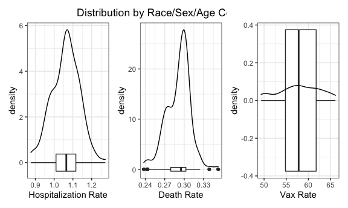

``` r
# Alternative correlation matrix
# Show only correlation values where p < 0.01
nyc_puma_summary %>% 
  select(-puma) %>% 
  cor_mat() %>% 
  cor_gather() %>% 
  filter(var1 %in% c("covid_hosp_rate", "covid_death_rate", "covid_vax_rate")) %>% 
  filter(!var2 %in% c("covid_hosp_rate", "covid_death_rate", "covid_vax_rate")) %>% 
  mutate(
    sig_p = ifelse(p < 0.01, T, F),
    p_if_sig = ifelse(p < 0.01, p, NA),
    r_if_sig = ifelse(p < 0.01, cor, NA)
  ) %>% 
  ggplot(aes(
    x = var1, 
    y = var2, 
    fill = cor,
    label = round(r_if_sig, 2))) + 
  geom_tile(color = "white") +  
  scale_x_discrete(
    labels = c("Death Rate", "Hosp Rate", "Vax Rate")
  ) + 
  geom_text(
    color = "white",
    size = 4
  )
```

    ## Warning: Removed 21 rows containing missing values (geom_text).


``` r
# Another alternative using size to represent correlation
nyc_puma_summary %>% 
  select(-puma) %>% 
  cor_mat() %>% 
  cor_gather() %>% 
  filter(var1 %in% c("covid_hosp_rate", "covid_death_rate", "covid_vax_rate")) %>% 
  filter(!var2 %in% c("covid_hosp_rate", "covid_death_rate", "covid_vax_rate")) %>% 
  mutate(
    sig_p = ifelse(p < 0.01, T, F),
    p_if_sig = ifelse(p < 0.01, p, NA),
    r_if_sig = ifelse(p < 0.01, cor, NA)
  ) %>% 
  ggplot(aes(
    x = var1,
    y = var2,
    color = cor,
    label = round(r_if_sig, 2)
  )) + 
  geom_tile(col = "black", fill = "white") + 
  geom_point(aes(size = abs(cor)), shape = 15) + 
  geom_text(color = "white", size = 2) + 
  scale_x_discrete(
    labels = c("Death Rate", "Hosp Rate", "Vax Rate")
  )
```

    ## Warning: Removed 21 rows containing missing values (geom_text).


``` r
# Notes for later:
# Reorder matrix?
```

#### PUMA-level outcome distributions

``` r
# Add county to each PUMA observation
nyc_puma_summary_counties = 
  nyc_puma_summary %>% 
  mutate(
    borough = as.factor(case_when(
      str_detect(puma, "37") ~ "Bronx",
      str_detect(puma, "38") ~ "Manhattan",
      str_detect(puma, "39") ~ "Staten Island",
      str_detect(puma, "40") ~ "Brooklyn",
      str_detect(puma, "41") ~ "Queens")
    )
  )

# Hospitalization rates across PUMAs, colored by borough
PUMA_hosp = nyc_puma_summary_counties %>% 
  ggplot(aes(x = fct_reorder(puma, covid_hosp_rate), y = covid_hosp_rate)) + 
  geom_point(aes(color = borough)) + 
  theme(axis.text.x = element_text(angle = 90, vjust = 0.5, hjust=1)) + 
  labs(
    x = "PUMA",
    y = "COVID hospitalization rate"
  )

# Death rates across PUMAs, colored by borough
PUMA_death = nyc_puma_summary_counties %>% 
  ggplot(aes(x = fct_reorder(puma, covid_death_rate), y = covid_death_rate)) + 
  geom_point(aes(color = borough)) + 
  theme(axis.text.x = element_text(angle = 90, vjust = 0.5, hjust=1)) + 
  labs(
    x = "PUMA",
    y = "COVID death rate"
  )

# Vax rates across PUMAs, colored by borough
PUMA_vax = nyc_puma_summary_counties %>% 
  ggplot(aes(x = fct_reorder(puma, covid_vax_rate), y = covid_vax_rate)) + 
  geom_point(aes(color = borough)) + 
  theme(axis.text.x = element_text(angle = 90, vjust = 0.5, hjust=1)) + 
  labs(
    x = "PUMA",
    y = "COVID vax rate"
  )

(PUMA_hosp + PUMA_death) / PUMA_vax
```


``` r
# Alternatively, can rank 10 "worst" and "best" for each to see how they compare

# PUMAs with highest hosp rates
PUMA_hosp_highest10 = nyc_puma_summary_counties %>% 
  arrange(desc(covid_hosp_rate)) %>% 
  mutate(
    rank = rank(desc(covid_hosp_rate))
  ) %>% 
  filter(rank < 11) %>% 
  ggplot(aes(x = fct_reorder(puma, desc(covid_hosp_rate)), y = covid_hosp_rate)) + 
  geom_bar(stat = "identity", aes(fill = borough)) + 
  labs(
    x = "PUMA",
    y = "COVID hospitalization rate"
  )

# PUMAs with highest death rates
PUMA_death_highest10 = nyc_puma_summary_counties %>% 
  arrange(desc(covid_death_rate)) %>% 
  mutate(
    rank = rank(desc(covid_death_rate))
  ) %>% 
  filter(rank < 11) %>% 
  ggplot(aes(x = fct_reorder(puma, desc(covid_death_rate)), y = covid_death_rate)) + 
  geom_bar(stat = "identity", aes(fill = borough)) + 
  labs(
    x = "PUMA",
    y = "COVID death rate"
  )

# PUMAs with lowest vax rates
PUMA_vax_lowest10 = nyc_puma_summary_counties %>% 
  arrange(covid_vax_rate) %>% 
  mutate(
    rank = rank(covid_vax_rate)
  ) %>% 
  filter(rank < 11) %>% 
  ggplot(aes(x = fct_reorder(puma, covid_vax_rate), y = covid_vax_rate)) + 
  geom_bar(stat = "identity", aes(fill = borough)) + 
  labs(
    x = "PUMA",
    y = "COVID vax rate"
  )

(PUMA_hosp_highest10 + PUMA_death_highest10) / PUMA_vax_lowest10
```


``` r
# PUMAs with lowest hosp rates
PUMA_hosp_lowest10 = nyc_puma_summary_counties %>% 
  arrange(covid_hosp_rate) %>% 
  mutate(
    rank = rank(desc(covid_hosp_rate))
  ) %>% 
  filter(rank < 11) %>% 
  ggplot(aes(x = fct_reorder(puma, covid_hosp_rate), y = covid_hosp_rate)) + 
  geom_bar(stat = "identity", aes(fill = borough)) +
  labs(
    x = "PUMA",
    y = "COVID hospitalization rate"
  )

# PUMAs with lowest death rates
PUMA_death_lowest10 = nyc_puma_summary_counties %>% 
  arrange(covid_death_rate) %>% 
  mutate(
    rank = rank(desc(covid_death_rate))
  ) %>% 
  filter(rank < 11) %>% 
  ggplot(aes(x = fct_reorder(puma, covid_death_rate), y = covid_death_rate)) + 
  geom_bar(stat = "identity", aes(fill = borough)) + 
  labs(
    x = "PUMA",
    y = "COVID death rate"
  )

# PUMAs with highest vax rates
PUMA_vax_highest10 = nyc_puma_summary_counties %>% 
  arrange(desc(covid_vax_rate)) %>% 
  mutate(
    rank = rank(desc(covid_vax_rate))
  ) %>% 
  filter(rank < 11) %>% 
  ggplot(aes(x = fct_reorder(puma, desc(covid_vax_rate)), y = covid_vax_rate)) + 
  geom_bar(stat = "identity", aes(fill = borough)) + 
  labs(
    x = "PUMA",
    y = "COVID vax rate"
  )

(PUMA_hosp_lowest10 + PUMA_death_lowest10) / PUMA_vax_highest10
```


``` r
# Can also determine "conversion rates", i.e. ratios of deaths to hospitalizations
# Here's an example
PUMA_ratio = nyc_puma_summary_counties %>% 
  mutate(
    ratio_death_to_hosp = covid_death_rate / covid_hosp_rate
  ) %>% 
  arrange(desc(ratio_death_to_hosp)) %>% 
  ggplot(aes(x = fct_reorder(puma, ratio_death_to_hosp), y = ratio_death_to_hosp)) + 
  geom_point(aes(color = borough)) + 
  theme(axis.text.x = element_text(angle = 90, vjust = 0.5, hjust=1)) + 
  labs(
    x = "PUMA",
    y = "Ratio of Death Rate to Hospitalization Rate"
  )
  
# First with the "worst" 10
PUMA_ratio_worst = nyc_puma_summary_counties %>% 
  mutate(
    ratio_death_to_hosp = covid_death_rate / covid_hosp_rate,
    rank = rank(desc(ratio_death_to_hosp))
  ) %>% 
  filter(rank < 11) %>% 
  ggplot(aes(x = fct_reorder(puma, desc(ratio_death_to_hosp)), y = ratio_death_to_hosp)) + 
  geom_bar(stat = "identity", aes(fill = borough)) + 
  labs(
    x = "Worst 10 PUMAs",
    y = "Ratio of Death Rate to Hospitalization Rate"
  )

# Then with the "best" 10
PUMA_ratio_best = nyc_puma_summary_counties %>% 
  mutate(
    ratio_death_to_hosp = covid_death_rate / covid_hosp_rate,
    rank = rank(ratio_death_to_hosp)
  ) %>% 
  filter(rank < 11) %>% 
  ggplot(aes(x = fct_reorder(puma, ratio_death_to_hosp), y = ratio_death_to_hosp)) + 
  geom_bar(stat = "identity", aes(fill = borough)) + 
  labs(
    x = "Best 10 PUMAs",
    y = "Ratio of Death Rate to Hospitalization Rate"
  )

PUMA_ratio_worst + PUMA_ratio_best
```


``` r
# Hospitalizations and deaths across PUMAs, colored by borough
hosps_and_deaths_PUMA = nyc_puma_summary_counties %>% 
  pivot_longer(
    cols = starts_with("covid"),
    values_to = 'outcome_rate'
  ) %>% 
  filter(!name == "covid_vax_rate") %>%
  group_by(borough) %>% 
  ggplot(
    aes(
      x = reorder(puma, outcome_rate, FUN = "median"),
      y = outcome_rate
    )
  ) + 
  geom_point(aes(color = borough)) + 
  facet_grid(name ~ .) + 
  theme(axis.text.x = element_text(angle = 90, vjust = 0.5, hjust=1)) + 
  labs(
    x = "PUMA",
    y = "Outcome Rate"
  )

# Vaccinations across PUMAs, colored by borough
# Separate from prior graph because different scale
vax_PUMA = nyc_puma_summary_counties %>% 
  pivot_longer(
    cols = starts_with("covid"),
    values_to = 'outcome_rate'
  ) %>% 
  filter(name == "covid_vax_rate") %>% 
  group_by(borough) %>% 
  ggplot(
    aes(
      x = reorder(puma, outcome_rate, FUN = "median"),
      y = outcome_rate
    )
  ) + 
  geom_point(aes(color = borough)) + 
  facet_grid(name ~ .) + 
  theme(axis.text.x = element_text(angle = 90, vjust = 0.5, hjust=1)) + 
  labs(
    x = "PUMA",
    y = "Vax Rate"
  )

hosps_and_deaths_PUMA / vax_PUMA
```

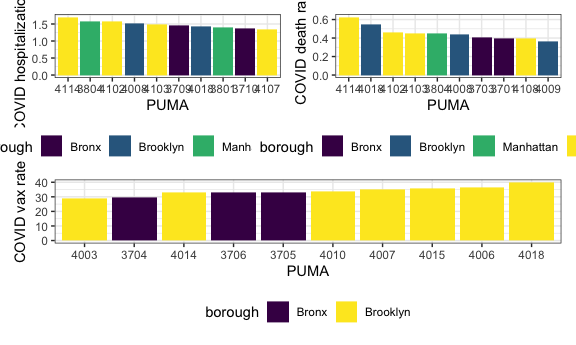

``` r
# Correlations between key outcome variables across PUMAs

# Hospitalizations and deaths
nyc_puma_summary_counties %>% 
  mutate(
    ratio = covid_death_rate / covid_hosp_rate
  ) %>% 
  ggplot(aes(x = covid_hosp_rate, y = covid_death_rate)) + 
  geom_point(aes(color = borough, size = ratio)) + 
  geom_smooth()
```

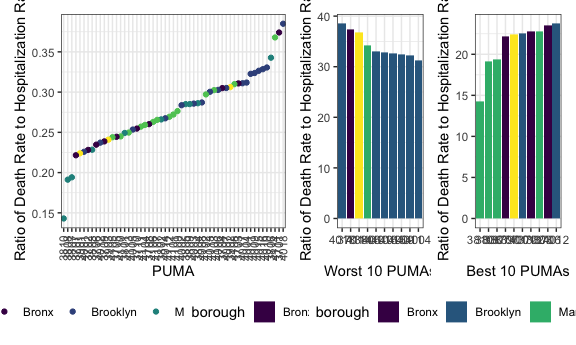

``` r
# Hospitalizations and vaccinations
nyc_puma_summary_counties %>% 
  mutate(
    ratio = covid_death_rate / covid_hosp_rate
  ) %>% 
  ggplot(aes(x = covid_hosp_rate, y = covid_vax_rate)) + 
  geom_point(aes(color = borough, size = ratio)) + 
  geom_smooth()
```


``` r
# Deaths and vaccinations
nyc_puma_summary_counties %>% 
  mutate(
    ratio = covid_death_rate / covid_hosp_rate
  ) %>% 
  ggplot(aes(x = covid_death_rate, y = covid_vax_rate)) + 
  geom_point(aes(color = borough, size = ratio)) + 
  geom_smooth()
```


``` r
# Ratio of deaths:hosps and vaccinations
nyc_puma_summary_counties %>% 
  mutate(
    ratio = covid_death_rate / covid_hosp_rate
  ) %>% 
  ggplot(aes(x = ratio, y = covid_vax_rate)) + 
  geom_point(aes(color = borough, size = ratio)) + 
  geom_smooth()
```


#### Borough-level outcome distributions

``` r
# Check number of PUMAs per borough
nyc_puma_summary_counties %>% 
  group_by(borough) %>% 
  summarize(
    n_obs = n()
  ) %>% 
  ggplot(aes(x = borough, y = n_obs)) + 
  geom_bar(stat = "identity")
```

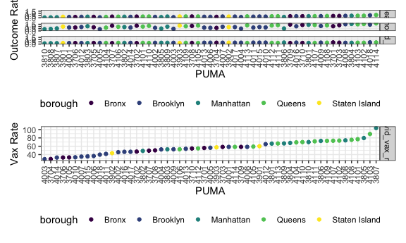

``` r
# Outcomes distribution by borough

# Hospitalizations across PUMAs in each borough
hosps = nyc_puma_summary_counties %>% 
  ggplot(aes(x = reorder(borough, covid_hosp_rate, FUN = "median"), y = covid_hosp_rate)) + 
  geom_boxplot(aes(fill = borough)) + 
  labs(
    x = "Borough",
    y = "COVID hospitalization rate"
  )

# Deaths across PUMAs in each borough
deaths = nyc_puma_summary_counties %>% 
  ggplot(aes(x = reorder(borough, covid_death_rate, FUN = "median"), y = covid_death_rate)) + 
  geom_boxplot(aes(fill = borough)) + 
  labs(
    x = "Borough",
    y = "COVID death rate"
  )

# Vax across PUMAs in each borough
vax = nyc_puma_summary_counties %>% 
  ggplot(aes(x = reorder(borough, covid_vax_rate, FUN = "median"), y = covid_vax_rate)) + 
  geom_boxplot(aes(fill = borough)) + 
  labs(
    x = "Borough",
    y = "COVID vax rate"
  )

hosps + deaths + vax
```

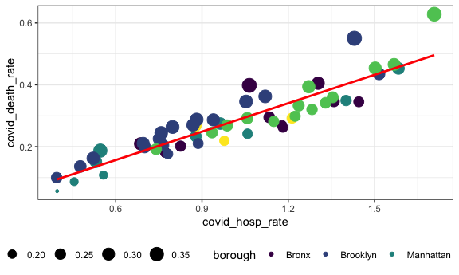

``` r
# Ratio of death rate to hosp rate in each borough
nyc_puma_summary_counties %>% 
  mutate(
    ratio = covid_death_rate / covid_hosp_rate
  ) %>% 
  ggplot(aes(x = reorder(borough, ratio, FUN = "median"), y = ratio)) + 
  geom_boxplot(aes(fill = borough)) + 
  labs(
    x = "Borough",
    y = "COVID death to hosp ratio"
  )
```

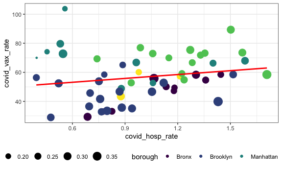

``` r
# Density plot of key outcome distributions across PUMAs, faceted by county
# Hospitalization rate
nyc_puma_summary_counties %>% 
  pivot_longer(
    cols = starts_with("covid"),
    values_to = 'outcome_rate'
  ) %>%
  filter(name == "covid_hosp_rate") %>% 
  ggplot(
    aes(
      x = outcome_rate / 100
    )
  ) + 
  geom_density(aes(color = borough, fill = borough), alpha = 0.1) + 
  labs(
    x = "Hosp Rate",
    y = "Density"
  )
```

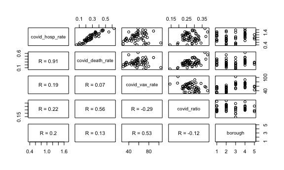

``` r
# Death rate
nyc_puma_summary_counties %>% 
  pivot_longer(
    cols = starts_with("covid"),
    values_to = 'outcome_rate'
  ) %>%
  filter(name == "covid_death_rate") %>% 
  ggplot(
    aes(
      x = outcome_rate / 100
    )
  ) + 
  geom_density(aes(color = borough, fill = borough), alpha = 0.1) + 
  labs(
    x = "Hosp Rate",
    y = "Density"
  )
```


``` r
# Vax rate
nyc_puma_summary_counties %>% 
  pivot_longer(
    cols = starts_with("covid"),
    values_to = 'outcome_rate'
  ) %>%
  filter(name == "covid_vax_rate") %>% 
  ggplot(
    aes(
      x = outcome_rate
    )
  ) + 
  geom_density(aes(fill = name), alpha = 0.3) + 
  facet_grid(.~borough) + 
  labs(
    x = "Vax Rate",
    y = "Density"
  )
```


``` r
# Try vax without borough faceting, but color/fill by borough
nyc_puma_summary_counties %>% 
  pivot_longer(
    cols = starts_with("covid"),
    values_to = 'outcome_rate'
  ) %>%
  filter(name == "covid_vax_rate") %>% 
  ggplot(
    aes(
      x = outcome_rate
    )
  ) + 
  geom_density(aes(fill = reorder(borough, outcome_rate, FUN = "median"), alpha = 0.1)) + 
  labs(
    x = "Vax rate",
    y = "Density"
  )
```


``` r
hosp_rate_by_borough = nyc_puma_summary_counties %>% 
  ggplot(aes(x = covid_hosp_rate, y = borough, fill = borough)) + 
  geom_density_ridges(scale = 0.6, alpha = 0.2, quantile_lines = TRUE, quantile_fun = function(x, ...)median(x)) + 
  labs(
    x = "Hospitalization rate",
    y = "Borough"
  )

death_rate_by_borough = nyc_puma_summary_counties %>% 
  ggplot(aes(x = covid_death_rate, y = borough, fill = borough)) + 
  geom_density_ridges(scale = 0.6, alpha = 0.2, quantile_lines = TRUE, quantile_fun = function(x, ...)median(x)) + 
  labs(
    x = "Death rate",
    y = "Borough"
  )

vax_rate_by_borough = nyc_puma_summary_counties %>% 
  ggplot(aes(x = covid_vax_rate, y = borough, fill = borough)) + 
  geom_density_ridges(scale = 0.6, alpha = 0.2, quantile_lines = TRUE, quantile_fun = function(x, ...)median(x)) + 
  labs(
    x = "Vax rate",
    y = "Borough"
  )

hosp_rate_by_borough + death_rate_by_borough + vax_rate_by_borough
```

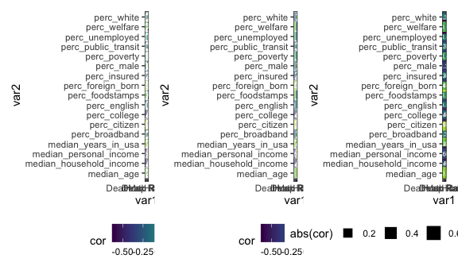

``` r
# Add columns that say whether a PUMA is above or below the median PUMA on a given outcome
above_below_outcome = nyc_puma_summary_counties %>% 
  mutate(
    above_hosp_median = as.factor(ifelse(covid_hosp_rate > median(covid_hosp_rate), 1, 0)),
    above_death_median = as.factor(ifelse(covid_death_rate > median(covid_death_rate), 1, 0)),
    above_vax_median = as.factor(ifelse(covid_vax_rate > median(covid_vax_rate), 1, 0))
  )

# Stacked bar charts: frequency

# PUMA hospitalization outcomes by borough
puma_prop_hosp = above_below_outcome %>% 
  group_by(borough) %>% 
  ggplot(aes(x = reorder(borough, above_hosp_median == 0), fill = above_hosp_median)) + 
  geom_bar(position = "fill") + 
  labs(
    x = "Borough",
    y = "Proportion of PUMAs Above/Below NYC PUMA Hosp Med"
  )

# PUMA death outcomes by borough
puma_prop_death = above_below_outcome %>% 
  group_by(borough) %>% 
  ggplot(aes(x = reorder(borough, above_death_median == 0), fill = above_death_median)) + 
  geom_bar(position = "fill") + 
  labs(
    x = "Borough",
    y = "Proportion of PUMAs Above/Below NYC PUMA Death Med"
  )

puma_prop_vax = above_below_outcome %>% 
  group_by(borough) %>% 
  ggplot(aes(x = reorder(borough, above_vax_median == 0), fill = above_vax_median)) + 
  geom_bar(position = "fill") + 
  labs(
    x = "Borough",
    y = "Proportion of PUMAs Above/Below NYC PUMA Vax Med"
  )

puma_prop_vax / (puma_prop_hosp | puma_prop_death)
```

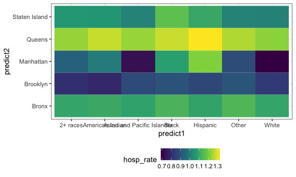

``` r
# Stacked bar charts: counts

# PUMA outcomes by borough
above_below_outcome %>%
  pivot_longer(
    cols = c(above_hosp_median, above_death_median, above_vax_median),
    names_to = "outcome",
    values_to = "outcome_rate"
  ) %>% 
  mutate(
    outcome_count = case_when(
      outcome_rate == 1 ~ "Above NYC PUMA Median",
      outcome_rate == 0 ~ "Below NYC PUMA Median"
    ),
    outcome = recode(outcome,
           "above_vax_median" = "Vax",
           "above_hosp_median"  =  "Hosp",
           "above_death_median" = "Death")
  ) %>% 
  group_by(outcome) %>% 
  ggplot(aes(x = outcome, fill = outcome_count)) + 
  geom_bar(stat = "count") + 
  facet_grid(. ~ borough) +
  labs(
    x = "Outcome",
    y = "Count of PUMAs Above/Below NYC PUMA Median"
  )
```


#### Outcomes vs Demographics across PUMAs

``` r
# Examples using a few different demographics for outcomes (excluding death for now, since generally somewhat redundant of hospitalizations)
# These are scatter plots

# Sex vs Hospitalization
nyc_puma_summary_counties %>% 
  ggplot(aes(
    x = perc_male,
    y = covid_hosp_rate
  )) + 
  geom_point() + 
  geom_smooth()
```

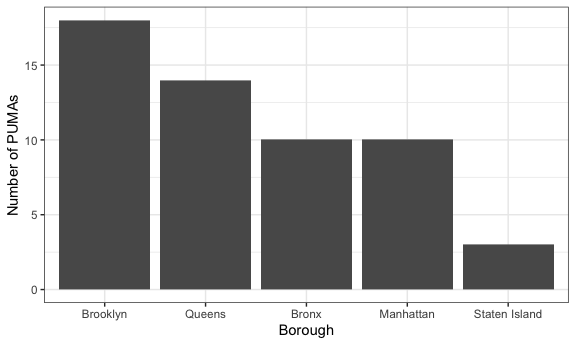

``` r
# Race vs Hospitalization
nyc_puma_summary_counties %>% 
  ggplot(aes(
    x = perc_white,
    y = covid_hosp_rate
  )) + 
  geom_point() + 
  geom_smooth()
```


``` r
# Age vs Hospitalization
nyc_puma_summary_counties %>% 
  ggplot(aes(
    x = median_age,
    y = covid_hosp_rate
  )) + 
  geom_point() + 
  geom_smooth()
```


``` r
# Basic function for predictor vs outcome on PUMA summary df
demo_puma_graph = function(predict, outcome){
  
  x = nyc_puma_summary_counties[[predict]]
  y = nyc_puma_summary_counties[[outcome]]
  
  nyc_puma_summary_counties %>% 
    ggplot(aes(
      x = x,
      y = y
    )) + 
    geom_point() + 
    geom_smooth(se = FALSE) + 
    labs(
      x = predict,
      y = outcome
    )
  
}

# Let's test on some basic demographics vs outcomes

# Sex vs hospitalization
demo_puma_graph("perc_male", "covid_hosp_rate")
```

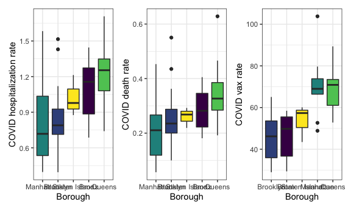

``` r
# Sex vs death
demo_puma_graph("perc_male", "covid_death_rate")
```

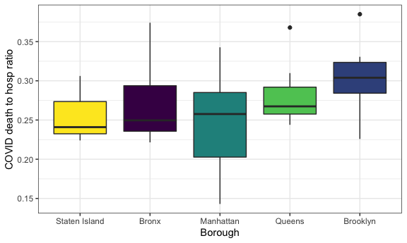

``` r
# Sex vs vax
demo_puma_graph("perc_male", "covid_vax_rate")
```


``` r
# Race vs hospitalization
demo_puma_graph("perc_white", "covid_hosp_rate")
```


``` r
# Race vs death
demo_puma_graph("perc_white", "covid_death_rate")
```


``` r
# Race vs vax
demo_puma_graph("perc_white", "covid_vax_rate")
```


``` r
# Age vs hospitalization
demo_puma_graph("median_age", "covid_hosp_rate")
```


``` r
# Age vs death
demo_puma_graph("median_age", "covid_death_rate")
```


``` r
# Age vs vax
demo_puma_graph("median_age", "covid_vax_rate")
```


``` r
# Let's test on some basic SES covariates vs outcomes
# Income vs vax
demo_puma_graph("median_household_income", "covid_vax_rate")
```


``` r
# Health insurance vs vax
demo_puma_graph("perc_insured", "covid_vax_rate")
```


``` r
# Foodstamps vs vax
demo_puma_graph("perc_foodstamps", "covid_vax_rate")
```


``` r
# Welfare vs vax
demo_puma_graph("perc_welfare", "covid_vax_rate")
```


``` r
# Education vs vax
demo_puma_graph("perc_college", "covid_vax_rate")
```


``` r
# We could try more descriptive scatter plots that include R, p values, if we'd like

# Load new package
library(ggpubr)

# Create new function
demo_puma_r_graph = function(predict, outcome){
  
  ggscatter(nyc_puma_summary_counties, x = predict, y = outcome, cor.coef = TRUE, cor.method = "pearson", add = "reg.line") + 
    geom_point(aes(color = borough))
  
}

# Test new function on college education vs vax rate
demo_puma_r_graph("perc_college", "covid_vax_rate")
```

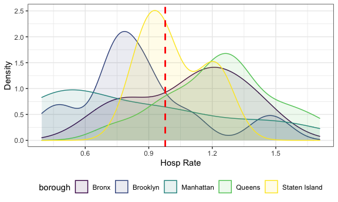

``` r
# Try on household income vs vax rate
demo_puma_r_graph("median_household_income", "covid_vax_rate")
```

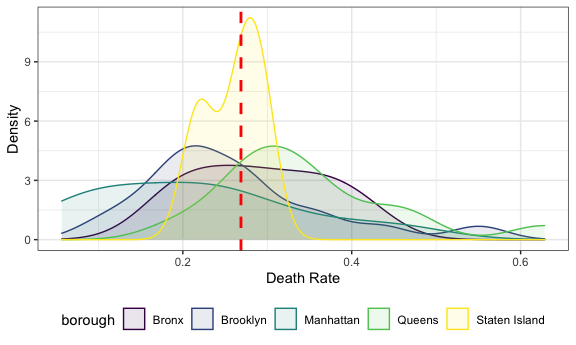

``` r
# Try on welfare vs vax rate
demo_puma_r_graph("perc_welfare", "covid_vax_rate")
```

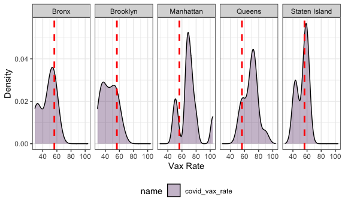

#### Outcomes vs Demographics across interviews

``` r
# Let's look at outcomes by demographics WITHOUT splitting by PUMA

# Create custom function for categorical predictors
outcome_catpredictor = function(predict, outcome){
  
  a = cleaned_data %>% 
    mutate(
      weighted_vax = perwt * puma_vacc_rate,
      weighted_hosp = perwt * puma_hosp_rate,
      weighted_death = perwt * puma_death_rate
    ) %>% 
    group_by({{predict}}) %>% 
    summarize(
      predictor_vax_rate = sum(weighted_vax) / sum(perwt),
      predictor_hosp_rate = sum(weighted_hosp) / sum(perwt),
      predictor_death_rate = sum(weighted_death) / sum(perwt),
      ratio = predictor_death_rate / predictor_hosp_rate
    )
  
  if (outcome == "vax") {
      ggplot(
        data = a,
        aes(
          x = reorder({{predict}}, predictor_vax_rate),
          y = predictor_vax_rate,
          fill = {{predict}}
        )
      ) + 
      geom_bar(stat = "identity")
  } else if (outcome == "hosp"){
    ggplot(
        data = a,
        aes(
          x = reorder({{predict}}, predictor_hosp_rate),
          y = predictor_hosp_rate,
          fill = {{predict}}
        )
      ) + 
      geom_bar(stat = "identity")
  } else if (outcome == "death"){
    ggplot(
        data = a,
        aes(
          x = reorder({{predict}}, predictor_death_rate),
          y = predictor_death_rate,
          fill = {{predict}}
        )
      ) + 
      geom_bar(stat = "identity")
  } else if (outcome == "ratio"){
    ggplot(
        data = a,
        aes(
          x = reorder({{predict}}, ratio),
          y = ratio,
          fill = {{predict}}
        )
      ) + 
      geom_bar(stat = "identity")
  }
}

# Let's test it on hospitalization rate by race
outcome_catpredictor(race, "hosp")
```

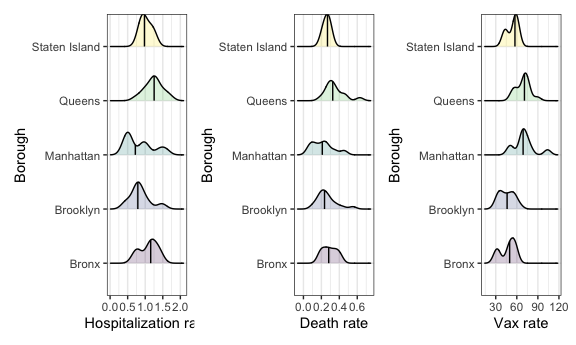

``` r
# Let's test it on vax rate by race
outcome_catpredictor(race, "vax")
```


``` r
# Let's test it on hospitalization rate by sex
outcome_catpredictor(sex, "vax")
```


``` r
# Let's test it on vax rate by welfare status
outcome_catpredictor(on_welfare, "vax")
```


``` r
# Let's test it on vax rate by broadband status
outcome_catpredictor(has_broadband, "vax")
```


``` r
# How about ratio of death rate to vax rate by welfare status? By sex?
outcome_catpredictor(on_welfare, "ratio")
```


``` r
# How about ratio of death rate to vax rate by welfare status?
outcome_catpredictor(sex, "ratio")
```


``` r
# Create another function for continuous predictors, such as age and income
outcome_continpredictor = function(predict, outcome){
  
  a = cleaned_data %>% 
    mutate(
      weighted_vax = perwt * puma_vacc_rate,
      weighted_hosp = perwt * puma_hosp_rate,
      weighted_death = perwt * puma_death_rate,
      predict_class = cut({{predict}}, breaks = 6)
    ) %>% 
    group_by(predict_class) %>% 
    summarize(
      predictor_vax_rate = sum(weighted_vax) / sum(perwt),
      predictor_hosp_rate = sum(weighted_hosp) / sum(perwt),
      predictor_death_rate = sum(weighted_death) / sum(perwt),
      ratio = predictor_death_rate / predictor_hosp_rate
    )
  
  if (outcome == "vax") {
      ggplot(
        data = a,
        aes(
          x = predict_class,
          y = predictor_vax_rate,
          fill = predict_class
        )
      ) + 
      geom_bar(stat = "identity")
  } else if (outcome == "hosp"){
    ggplot(
        data = a,
        aes(
          x = predict_class,
          y = predictor_hosp_rate,
          fill = predict_class
        )
      ) + 
      geom_bar(stat = "identity")
  } else if (outcome == "death"){
    ggplot(
        data = a,
        aes(
          x = predict_class,
          y = predictor_death_rate,
          fill = predict_class
        )
      ) + 
      geom_bar(stat = "identity")
  } else if (outcome == "ratio"){
     ggplot(
        data = a,
        aes(
          x = predict_class,
          y = ratio,
          fill = predict_class
        )
      ) + 
      geom_bar(stat = "identity")
  }
}

# Test on vaccination by age
outcome_continpredictor(age, "vax")
```


``` r
# Test on hospitalization by household income
outcome_continpredictor(household_income, "vax")
```


``` r
# Test on death to hospitalization ratio by household income, or by age
outcome_continpredictor(household_income, "ratio")
```


``` r
outcome_continpredictor(age, "ratio")
```


``` r
# Comparisons within boroughs

# Write a custom function for categorical predictors
borough_cat_comparisons = function(predict, outcome) {
  
  a = cleaned_data %>% 
    mutate(
      weighted_hosp = perwt * puma_hosp_rate,
      weighted_vax = perwt * puma_vacc_rate,
      weighted_death = perwt * puma_death_rate
  ) %>%
    group_by({{predict}}, borough) %>% 
    summarize(
      predictor_vax_rate = sum(weighted_vax) / sum(perwt),
      predictor_hosp_rate = sum(weighted_hosp) / sum(perwt),
      predictor_death_rate = sum(weighted_death) / sum(perwt),
      ratio = predictor_death_rate / predictor_hosp_rate,
      num_people = sum(perwt),
      num_hosp = sum(weighted_hosp) / 100,
      num_vax = sum(weighted_vax) / 100,
      num_death = sum(weighted_death) / 100
    )
  
  scatter_df = cleaned_data %>% 
        group_by(puma, {{predict}}, borough) %>% 
        summarize(
          num_people = sum(perwt),
          puma_vacc_rate = median(puma_vacc_rate),
          number_vaxxed = num_people * puma_vacc_rate / 100,
          puma_hosp_rate = median(puma_hosp_rate),
          number_hosp = num_people * puma_hosp_rate / 100,
          puma_death_rate = median(puma_death_rate),
          number_death = num_people * puma_death_rate / 100
        ) %>% 
        group_by({{predict}}, borough) %>% 
        summarize(
          number_people = sum(num_people),
          num_vax = sum(number_vaxxed),
          num_hosp = sum(number_hosp),
          num_death = sum(number_death),
          perc_hosp = num_hosp * 100 / number_people,
          perc_death = num_death * 100 / number_people,
          perc_vax = num_vax * 100 / number_people
        )
      
    if (outcome == "vax") {
      grouped = ggplot(
        data = a,
        aes(
          x = reorder(borough, predictor_vax_rate),
          y = predictor_vax_rate,
          fill = {{predict}}
        )
      ) + 
      geom_bar(position = "dodge", stat = "identity")
      
      compare = a %>% 
        pivot_longer(
          cols = num_people:num_death,
          names_to = "type",
          values_to = "count"
        ) %>% 
        filter(type %in% c("num_people", "num_vax")) %>% 
        ggplot(
          aes(x = type,
              y = count,
              fill = {{predict}}
          )
        ) + 
        geom_bar(stat = "identity", position = "fill") + 
        facet_wrap(.~borough)
      
    stack = a %>% 
      ggplot(aes(
        x = borough,
        y = num_vax,
        fill = {{predict}}
      )
      ) + 
      geom_bar(stat = "identity")
      
      vary1 = scatter_df %>% 
      ggplot(aes(x = borough, y = perc_vax)) + 
      geom_point(aes(color = {{predict}}))
      
      (grouped + stack + compare) / vary1
  } else if (outcome == "hosp"){
    grouped = ggplot(
        data = a,
        aes(
          x = reorder(borough, predictor_hosp_rate),
          y = predictor_hosp_rate,
          fill = {{predict}}
        )
      ) + 
    geom_bar(position = "dodge", stat = "identity")
    
    compare = a %>% 
        pivot_longer(
          cols = num_people:num_death,
          names_to = "type",
          values_to = "count"
        ) %>% 
        filter(type %in% c("num_people", "num_hosp")) %>% 
        ggplot(
          aes(x = type,
              y = count,
              fill = {{predict}}
          )
        ) + 
        geom_bar(stat = "identity", position = "fill") + 
        facet_wrap(.~borough)
      
      stack = a %>% 
      ggplot(aes(
        x = borough,
        y = num_hosp,
        fill = {{predict}}
      )
      ) + 
      geom_bar(stat = "identity")
      
      vary1 = scatter_df %>% 
      ggplot(aes(x = borough, y = perc_hosp)) + 
      geom_point(aes(color = {{predict}}))
      
      (grouped + stack + compare) / vary1
  } else if (outcome == "death"){
    grouped = ggplot(
        data = a,
        aes(
          x = reorder(borough, predictor_death_rate),
          y = predictor_death_rate,
          fill = {{predict}}
        )
      ) + 
      geom_bar(position = "dodge", stat = "identity")
    
    compare = a %>% 
        pivot_longer(
          cols = num_people:num_death,
          names_to = "type",
          values_to = "count"
        ) %>% 
        filter(type %in% c("num_people", "num_death")) %>% 
        ggplot(
          aes(x = type,
              y = count,
              fill = {{predict}}
          )
        ) + 
        geom_bar(stat = "identity", position = "fill") + 
        facet_wrap(.~borough)
      
      stack = a %>% 
      ggplot(aes(
        x = borough,
        y = num_death,
        fill = {{predict}}
      )
      ) + 
      geom_bar(stat = "identity")
      
      vary1 = scatter_df %>% 
      ggplot(aes(x = borough, y = perc_death)) + 
      geom_point(aes(color = {{predict}}))
      
      (grouped + stack + compare) / vary1
  } else if (outcome == "ratio"){
    grouped = ggplot(
        data = a,
        aes(
          x = reorder({{predict}}, ratio),
          y = ratio,
          fill = {{predict}}
        )
      ) + 
      geom_bar(position = "dodge", stat = "identity")
  }
}


# Test on hospitalizations by race
borough_cat_comparisons(race, "hosp")
```

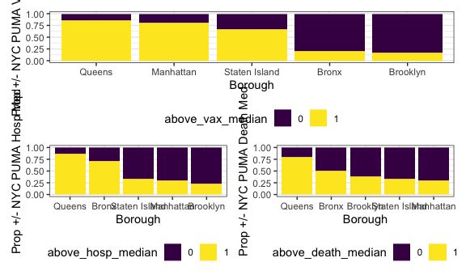

``` r
# Test on vaccinations by race
borough_cat_comparisons(race, "vax")
```

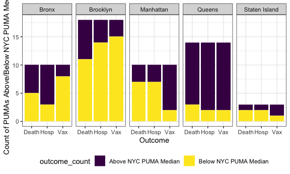

``` r
# Test on vaccinations by sex
borough_cat_comparisons(sex, "vax")
```


``` r
# Let's do similar for continuous predictors
borough_contin_comparisons = function(predict, outcome) {
  
  a = cleaned_data %>% 
        mutate(
          weighted_hosp = perwt * puma_hosp_rate,
          weighted_vax = perwt * puma_vacc_rate,
          weighted_death = perwt * puma_death_rate,
          predict_class = cut({{predict}}, breaks = 6)
      ) %>%
        group_by(predict_class, borough) %>% 
        summarize(
          predictor_vax_rate = sum(weighted_vax) / sum(perwt),
          predictor_hosp_rate = sum(weighted_hosp) / sum(perwt),
          predictor_death_rate = sum(weighted_death) / sum(perwt),
          ratio = predictor_death_rate / predictor_hosp_rate,
          num_people = sum(perwt),
          num_hosp = sum(weighted_hosp) / 100,
          num_vax = sum(weighted_vax) / 100,
          num_death = sum(weighted_death) / 100
        )
  
  scatter_df = cleaned_data %>% 
        mutate(
          predict_class = cut({{predict}}, breaks = 6)
        ) %>% 
        group_by(puma, predict_class, borough) %>% 
        summarize(
          num_people = sum(perwt),
          puma_vacc_rate = median(puma_vacc_rate),
          number_vaxxed = num_people * puma_vacc_rate / 100,
          puma_hosp_rate = median(puma_hosp_rate),
          number_hosp = num_people * puma_hosp_rate / 100,
          puma_death_rate = median(puma_death_rate),
          number_death = num_people * puma_death_rate / 100
        ) %>% 
        group_by(predict_class, borough) %>% 
        summarize(
          number_people = sum(num_people),
          num_vax = sum(number_vaxxed),
          num_hosp = sum(number_hosp),
          num_death = sum(number_death),
          perc_hosp = num_hosp / number_people,
          perc_death = num_death / number_people,
          perc_vax = num_vax / number_people
        )
  
    if (outcome == "vax") {
      grouped = ggplot(
        data = a,
        aes(
          x = reorder(borough, predictor_vax_rate),
          y = predictor_vax_rate,
          fill = predict_class
        )
      ) + 
      geom_bar(position = "dodge", stat = "identity")
      
      compare = a %>% 
        pivot_longer(
          cols = num_people:num_death,
          names_to = "type",
          values_to = "count"
        ) %>% 
        filter(type %in% c("num_people", "num_vax")) %>% 
        ggplot(
          aes(x = type,
              y = count,
              fill = predict_class
          )
        ) + 
        geom_bar(stat = "identity", position = "fill") + 
        facet_wrap(.~borough)
      
    stack = a %>% 
      ggplot(aes(
        x = borough,
        y = num_vax,
        fill = predict_class
      )
      ) + 
      geom_bar(stat = "identity")
    
    vary1 = scatter_df %>% 
      ggplot(aes(x = borough, y = perc_vax)) + 
      geom_point(aes(color = predict_class))
    
    vary2 = scatter_df %>% 
      ggplot(aes(x = predict_class, y = perc_vax, color = borough, group = borough)) + 
      geom_point() + 
      geom_smooth()
      
      (grouped + stack + compare) / (vary1 + vary2)
  } else if (outcome == "hosp"){
    grouped = ggplot(
        data = a,
        aes(
          x = reorder(borough, predictor_hosp_rate),
          y = predictor_hosp_rate,
          fill = predict_class
        )
      ) + 
    geom_bar(position = "dodge", stat = "identity")
    
    compare = a %>% 
        pivot_longer(
          cols = num_people:num_death,
          names_to = "type",
          values_to = "count"
        ) %>% 
        filter(type %in% c("num_people", "num_hosp")) %>% 
        ggplot(
          aes(x = type,
              y = count,
              fill = predict_class
          )
        ) + 
        geom_bar(stat = "identity", position = "fill") + 
        facet_wrap(.~borough)
      
      stack = a %>% 
      ggplot(aes(
        x = borough,
        y = num_hosp,
        fill = predict_class
      )
      ) + 
      geom_bar(stat = "identity")
      
      vary1 = scatter_df %>% 
      ggplot(aes(x = borough, y = perc_hosp)) + 
      geom_point(aes(color = predict_class))
      
      vary2 = scatter_df %>% 
      ggplot(aes(x = predict_class, y = perc_hosp, color = borough, group = borough)) + 
      geom_point() + 
      geom_smooth()
      
      (grouped + stack + compare) / (vary1 + vary2)
  } else if (outcome == "death"){
    grouped = ggplot(
        data = a,
        aes(
          x = reorder(borough, predictor_death_rate),
          y = predictor_death_rate,
          fill = predict_class
        )
      ) + 
      geom_bar(position = "dodge", stat = "identity")
    
    compare = a %>% 
        pivot_longer(
          cols = num_people:num_death,
          names_to = "type",
          values_to = "count"
        ) %>% 
        filter(type %in% c("num_people", "num_death")) %>% 
        ggplot(
          aes(x = type,
              y = count,
              fill = predict_class
          )
        ) + 
        geom_bar(stat = "identity", position = "fill") + 
        facet_wrap(.~borough)
      
      stack = a %>% 
      ggplot(aes(
        x = borough,
        y = num_death,
        fill = predict_class
      )
      ) + 
      geom_bar(stat = "identity")
      
      vary1 = scatter_df %>% 
      ggplot(aes(x = borough, y = perc_death)) + 
      geom_point(aes(color = predict_class))
      
      vary2 = scatter_df %>% 
      ggplot(aes(x = predict_class, y = perc_death, color = borough, group = borough)) + 
      geom_point() + 
      geom_smooth()
      
      (grouped + stack + compare) / (vary1 + vary2)
  } else if (outcome == "ratio"){
    grouped = ggplot(
        data = a,
        aes(
          x = reorder(predict_class, ratio),
          y = ratio,
          fill = predict_class
        )
      ) + 
      geom_bar(position = "dodge", stat = "identity")
  }
}

# Test on age vs. vax rate
borough_contin_comparisons(age, "vax")
```

    ## Warning in simpleLoess(y, x, w, span, degree = degree, parametric =
    ## parametric, : Chernobyl! trL>n 6

    ## Warning in simpleLoess(y, x, w, span, degree = degree, parametric =
    ## parametric, : Chernobyl! trL>n 6

    ## Warning in sqrt(sum.squares/one.delta): NaNs produced

    ## Warning in stats::qt(level/2 + 0.5, pred$df): NaNs produced

    ## Warning in simpleLoess(y, x, w, span, degree = degree, parametric =
    ## parametric, : Chernobyl! trL>n 6

    ## Warning in simpleLoess(y, x, w, span, degree = degree, parametric =
    ## parametric, : Chernobyl! trL>n 6

    ## Warning in sqrt(sum.squares/one.delta): NaNs produced

    ## Warning in stats::qt(level/2 + 0.5, pred$df): NaNs produced

    ## Warning in simpleLoess(y, x, w, span, degree = degree, parametric =
    ## parametric, : Chernobyl! trL>n 6

    ## Warning in simpleLoess(y, x, w, span, degree = degree, parametric =
    ## parametric, : Chernobyl! trL>n 6

    ## Warning in sqrt(sum.squares/one.delta): NaNs produced

    ## Warning in stats::qt(level/2 + 0.5, pred$df): NaNs produced

    ## Warning in simpleLoess(y, x, w, span, degree = degree, parametric =
    ## parametric, : Chernobyl! trL>n 6

    ## Warning in simpleLoess(y, x, w, span, degree = degree, parametric =
    ## parametric, : Chernobyl! trL>n 6

    ## Warning in sqrt(sum.squares/one.delta): NaNs produced

    ## Warning in stats::qt(level/2 + 0.5, pred$df): NaNs produced

    ## Warning in simpleLoess(y, x, w, span, degree = degree, parametric =
    ## parametric, : Chernobyl! trL>n 6

    ## Warning in simpleLoess(y, x, w, span, degree = degree, parametric =
    ## parametric, : Chernobyl! trL>n 6

    ## Warning in sqrt(sum.squares/one.delta): NaNs produced

    ## Warning in stats::qt(level/2 + 0.5, pred$df): NaNs produced

    ## Warning in max(ids, na.rm = TRUE): no non-missing arguments to max; returning
    ## -Inf

    ## Warning in max(ids, na.rm = TRUE): no non-missing arguments to max; returning
    ## -Inf

    ## Warning in max(ids, na.rm = TRUE): no non-missing arguments to max; returning
    ## -Inf

    ## Warning in max(ids, na.rm = TRUE): no non-missing arguments to max; returning
    ## -Inf

    ## Warning in max(ids, na.rm = TRUE): no non-missing arguments to max; returning
    ## -Inf

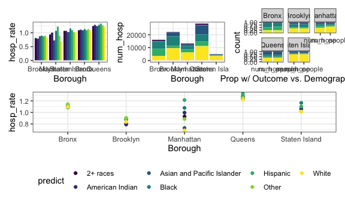

``` r
# Test on rent vs. hosp rate
borough_contin_comparisons(rent, "hosp")
```

    ## Warning in simpleLoess(y, x, w, span, degree = degree, parametric =
    ## parametric, : Chernobyl! trL>n 6

    ## Warning in simpleLoess(y, x, w, span, degree = degree, parametric =
    ## parametric, : Chernobyl! trL>n 6

    ## Warning in sqrt(sum.squares/one.delta): NaNs produced

    ## Warning in stats::qt(level/2 + 0.5, pred$df): NaNs produced

    ## Warning in simpleLoess(y, x, w, span, degree = degree, parametric =
    ## parametric, : Chernobyl! trL>n 6

    ## Warning in simpleLoess(y, x, w, span, degree = degree, parametric =
    ## parametric, : Chernobyl! trL>n 6

    ## Warning in sqrt(sum.squares/one.delta): NaNs produced

    ## Warning in stats::qt(level/2 + 0.5, pred$df): NaNs produced

    ## Warning in simpleLoess(y, x, w, span, degree = degree, parametric =
    ## parametric, : Chernobyl! trL>n 6

    ## Warning in simpleLoess(y, x, w, span, degree = degree, parametric =
    ## parametric, : Chernobyl! trL>n 6

    ## Warning in sqrt(sum.squares/one.delta): NaNs produced

    ## Warning in stats::qt(level/2 + 0.5, pred$df): NaNs produced

    ## Warning in simpleLoess(y, x, w, span, degree = degree, parametric =
    ## parametric, : Chernobyl! trL>n 6

    ## Warning in simpleLoess(y, x, w, span, degree = degree, parametric =
    ## parametric, : Chernobyl! trL>n 6

    ## Warning in sqrt(sum.squares/one.delta): NaNs produced

    ## Warning in stats::qt(level/2 + 0.5, pred$df): NaNs produced

    ## Warning in simpleLoess(y, x, w, span, degree = degree, parametric =
    ## parametric, : Chernobyl! trL>n 6

    ## Warning in simpleLoess(y, x, w, span, degree = degree, parametric =
    ## parametric, : Chernobyl! trL>n 6

    ## Warning in sqrt(sum.squares/one.delta): NaNs produced

    ## Warning in stats::qt(level/2 + 0.5, pred$df): NaNs produced

    ## Warning in max(ids, na.rm = TRUE): no non-missing arguments to max; returning
    ## -Inf

    ## Warning in max(ids, na.rm = TRUE): no non-missing arguments to max; returning
    ## -Inf

    ## Warning in max(ids, na.rm = TRUE): no non-missing arguments to max; returning
    ## -Inf

    ## Warning in max(ids, na.rm = TRUE): no non-missing arguments to max; returning
    ## -Inf

    ## Warning in max(ids, na.rm = TRUE): no non-missing arguments to max; returning
    ## -Inf

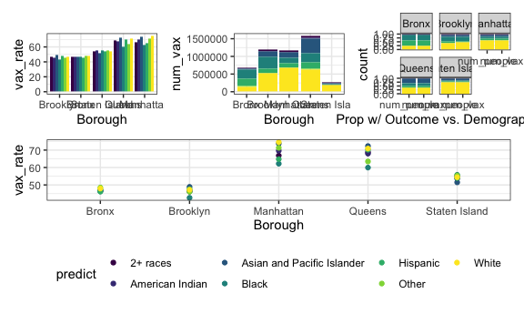

``` r
# We may want to visualize demographic disparity within a borough on any given predictor
# Here is an example of what we can do looking at variation in household income by race in each borough
cleaned_data %>% 
  mutate(
    weighted_income = perwt * household_income
  ) %>% 
  group_by(race, borough) %>% 
  summarize(
    people = sum(perwt),
    weighted_income = sum(weighted_income, na.rm = TRUE) / people
  ) %>% 
  ggplot(aes(x = borough, y = weighted_income)) + 
  geom_point(aes(color = race))
```


``` r
# Build a function to examine outcome breakdowns across 2 categorical variables

two_cat_outcome = function(predict1, predict2, outcome){
  
  a = cleaned_data %>% 
    group_by({{predict1}}, {{predict2}}, puma) %>% 
    summarize(
      num_people = sum(perwt),
      puma_vax_rate = median(puma_vacc_rate),
      people_vaxxed = num_people * puma_vax_rate / 100,
      puma_hosp_rate = median(puma_hosp_rate),
      people_hosp = num_people * puma_hosp_rate / 100,
      puma_death_rate = median(puma_death_rate),
      people_dead = num_people * puma_death_rate / 100
    ) %>% 
    group_by({{predict1}}, {{predict2}}) %>% 
    summarize(
      people = sum(num_people),
      num_vaxxed = sum(people_vaxxed),
      num_hosp = sum(people_hosp),
      num_dead = sum(people_dead),
      perc_vaxxed = num_vaxxed * 100 / people,
      perc_hosp = num_hosp * 100 / people,
      perc_dead = num_dead * 100 / people
    )
  
  if (outcome == "vax"){
    
    one = ggplot(data = a,
           aes(
             x = perc_vaxxed, 
             y = {{predict1}},
             fill = {{predict2}},
             color = {{predict2}}
           )
    ) + 
      geom_point(alpha = 0.6) + 
      coord_flip()
    
    two = ggplot(data = a,
           aes(
             x = perc_vaxxed,
             y = {{predict1}},
             fill = {{predict2}},
             color = {{predict2}}
           )) + 
      geom_bar(position = "dodge", stat = "identity")
    
    one + two
  } else if (outcome == "hosp") {
    one = ggplot(data = a,
           aes(
             x = perc_hosp, 
             y = {{predict1}},
             fill = {{predict2}},
             color = {{predict2}}
           )
    ) + 
      geom_point(alpha = 0.6) + 
      coord_flip()
    
    two = ggplot(data = a,
           aes(
             x = perc_hosp,
             y = {{predict1}},
             fill = {{predict2}},
             color = {{predict2}}
           )) + 
      geom_bar(position = "dodge", stat = "identity")
    
    one + two
  } else if (outcome == "death") {
    one = ggplot(data = a,
           aes(
             x = perc_dead, 
             y = {{predict1}},
             fill = {{predict2}},
             color = {{predict2}}
           )
    ) + 
      geom_point(alpha = 0.6) + 
      coord_flip()
    
    two = ggplot(data = a,
           aes(
             x = perc_dead,
             y = {{predict1}},
             fill = {{predict2}},
             color = {{predict2}}
           )) + 
      geom_bar(position = "dodge", stat = "identity")
    
    one + two
  }
}

# Test on vaccination rate by race and sex    
two_cat_outcome(race, sex, "vax") 
```

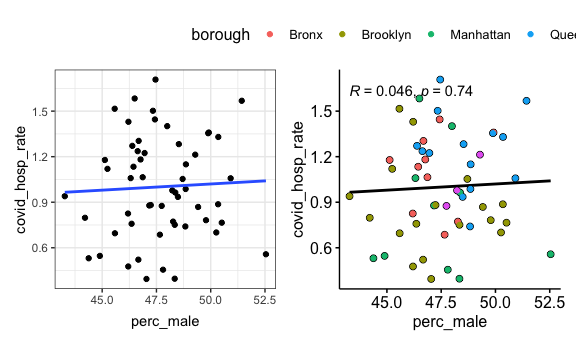

``` r
# Test on vaccination rate by welfare and race    
two_cat_outcome(on_welfare, race, "vax") 
```

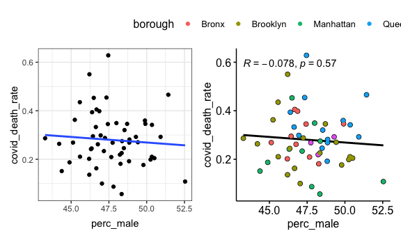

``` r
# Test on hospitalization rate by insurance status and race
two_cat_outcome(health_insurance, race, "hosp")
```


``` r
# Test on death rate by sex and broadband
two_cat_outcome(has_broadband, race, "death")
```


``` r
# Test on borough and sex
two_cat_outcome(race, borough, "vax")
```

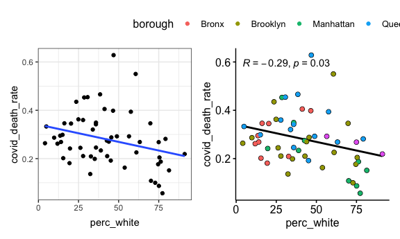

``` r
# Build a similar function to examine outcome breakdowns but across one categorical and one continuous

cat_and_cont_outcome = function(catpredict, contpredict, outcome){
  
  # Counts
  a = cleaned_data %>% 
    mutate(
      weighted_vax_num = perwt * puma_vacc_rate / 100,
      weighted_hosp_num = perwt * puma_hosp_rate / 100,
      weighted_death_num = perwt * puma_death_rate / 100
    ) %>% 
    group_by({{contpredict}}, {{catpredict}}) %>% 
    summarize(
      hosp = sum(weighted_hosp_num),
      vax = sum(weighted_vax_num),
      death = sum(weighted_death_num)
    )
  
  b = a %>% 
    mutate(
      all_hosp = sum(hosp),
      all_vax = sum(vax),
      all_death = sum(death),
      perc_hosp = hosp * 100 / all_hosp,
      perc_death = death * 100 / all_death,
      perc_vax = vax * 100 / all_vax
    )

  
  if (outcome == "vax"){
    
    one = ggplot(
      data = a,
      aes(
        x = {{contpredict}}, y = vax, fill = {{catpredict}}
      )
    ) + 
      geom_area(alpha = 0.6)
    
    two = ggplot(
      data = b,
      aes(
        x = {{contpredict}},
        y = perc_vax,
        fill = {{catpredict}}
      )
    ) + 
      geom_area(alpha = 0.6)
    
    one + two
  } else if (outcome == "hosp") {
    one = ggplot(
      data = a,
      aes(
        x = {{contpredict}}, y = hosp, fill = {{catpredict}}
      )
    ) + 
      geom_area(alpha = 0.6)
    
    two = ggplot(
      data = b,
      aes(
        x = {{contpredict}},
        y = perc_hosp,
        fill = {{catpredict}}
      )
    ) + 
      geom_area(alpha = 0.6)
    
    one + two
  } else if (outcome == "death") {
    one = ggplot(
      data = a,
      aes(
        x = {{contpredict}}, y = death, fill = {{catpredict}}
      )
    ) + 
      geom_area(alpha = 0.6)
    
    two = ggplot(
      data = b,
      aes(
        x = {{contpredict}},
        y = perc_death,
        fill = {{catpredict}}
      )
    ) + 
      geom_area(alpha = 0.6)
    
    one + two
  }
}

# Test on race and age for vaccination
cat_and_cont_outcome(race, age, "vax")
```

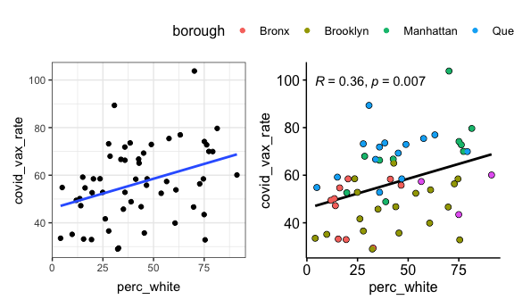

``` r
# Test on race and rent for hospitalization
cat_and_cont_outcome(race, rent, "hosp")
```

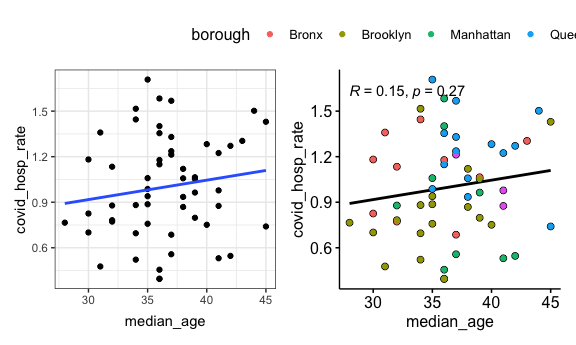

``` r
# Add a function for ridge plots for two categorical variables

ridge_two_cat = function(predict1, predict2, outcome){
  
  a = cleaned_data %>% 
    group_by({{predict1}}, puma, {{predict2}}, borough) %>% 
    summarize(
      num_people = sum(perwt),
      puma_vax_rate = median(puma_vacc_rate),
      puma_hosp_rate = median(puma_hosp_rate),
      puma_death_rate = median(puma_death_rate),
      people_vaxxed = num_people * puma_vax_rate / 100,
      people_hosp = num_people * puma_hosp_rate / 100,
      people_dead = num_people * puma_death_rate / 100
    ) %>% 
    group_by({{predict1}}, {{predict2}}, borough) %>% 
    summarize(
      people = sum(num_people),
      perc_vaxxed = sum(people_vaxxed) * 100 / people,
      perc_hosp = sum(people_hosp) * 100 / people,
      perc_dead = sum(people_dead) * 100 / people
    )
  
    if (outcome == "vax"){
    
      a %>% 
        ggplot(aes(
          x = perc_vaxxed,
          y = {{predict1}},
          color = {{predict2}},
          fill = {{predict2}}
        )) + 
        geom_density_ridges(alpha = 0.3)
    
  } else if (outcome == "hosp") {
    
    a %>% 
        ggplot(aes(
          x = perc_hosp,
          y = {{predict1}},
          color = {{predict2}},
          fill = {{predict2}}
        )) + 
        geom_density_ridges(alpha = 0.3)
    
  } else if (outcome == "death") {
    a %>% 
        ggplot(aes(
          x = perc_dead,
          y = {{predict1}},
          color = {{predict2}},
          fill = {{predict2}}
        )) + 
        geom_density_ridges(alpha = 0.3)
  }
}

# Test on vaccination rate by sex and race
ridge_two_cat(race, sex, "vax")
```


``` r
# Test on vaccination rate by welfare and sex
ridge_two_cat(sex, on_welfare, "vax")
```


``` r
# Another fun one: borough and sex
cleaned_data %>% 
  group_by(race, puma, sex, borough) %>% 
  summarize(
    num_people = sum(perwt),
    puma_vax_rate = median(puma_vacc_rate),
    people_vaxxed = num_people * puma_vax_rate / 100,
    people_not_vaxxed = num_people - people_vaxxed
  ) %>% 
  group_by(race, sex, borough) %>% 
  summarize(
    num_vaxxed = sum(people_vaxxed),
    num_not_vaxxed = sum(people_not_vaxxed),
    perc_vaxxed = num_vaxxed * 100 / (num_vaxxed + num_not_vaxxed)
  ) %>% 
  ggplot(aes(x = perc_vaxxed, y = borough, color = sex, fill = sex)) + 
  geom_density_ridges(alpha = 0.3, size = 0.5)
```

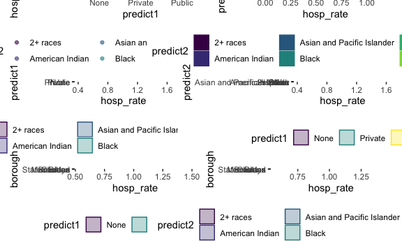

``` r
# Also race and sex
cleaned_data %>% 
  group_by(race, puma, sex, borough) %>% 
  summarize(
    num_people = sum(perwt),
    puma_vax_rate = median(puma_vacc_rate),
    people_vaxxed = num_people * puma_vax_rate / 100,
    people_not_vaxxed = num_people - people_vaxxed
  ) %>% 
  group_by(race, sex, borough) %>% 
  summarize(
    num_vaxxed = sum(people_vaxxed),
    num_not_vaxxed = sum(people_not_vaxxed),
    perc_vaxxed = num_vaxxed * 100 / (num_vaxxed + num_not_vaxxed)
  ) %>% 
  ggplot(aes(x = perc_vaxxed, y = sex, color = race, fill = race)) + 
  geom_density_ridges(alpha = 0.3, size = 0.5)
```

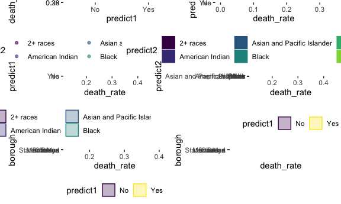

#### Other Explorations

``` r
# Another function to plot PUMAs based on a continuous predictor and an outcome, colored by a second predictor

predict_scatter = function(contpredict, predict2, outcome){
  
  nyc_puma_summary_counties %>% 
    mutate(
      vax = covid_vax_rate,
      hosp = covid_hosp_rate,
      death = covid_death_rate
    ) %>% 
    ggplot(aes(
      x = {{contpredict}},
      y = {{outcome}}
    )) + 
    geom_point(aes(color = {{predict2}}))
  
}

# Testing on hospitalization rate by household income, colored by college completion percentage
predict_scatter(median_household_income, perc_college, hosp)
```

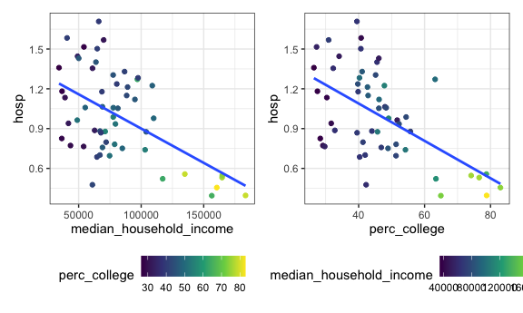

``` r
# More examples
predict_scatter(median_household_income, perc_college, death)
```

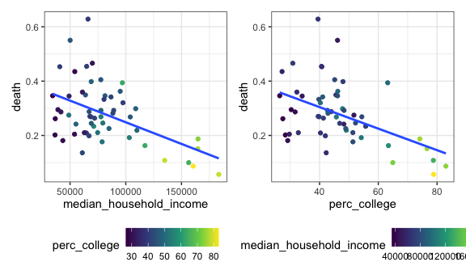

``` r
predict_scatter(perc_white, perc_male, death)
```

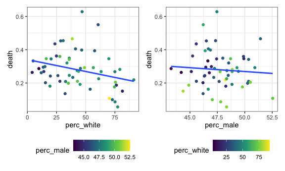

``` r
predict_scatter(perc_foodstamps, perc_white, vax)
```

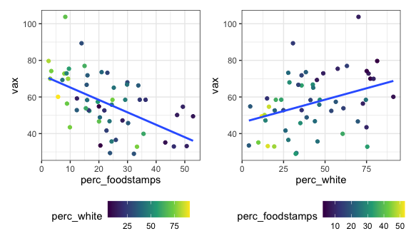

``` r
predict_scatter(perc_welfare, perc_white, vax)
```

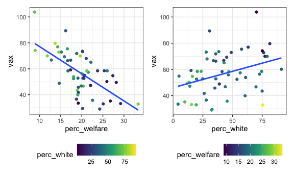

``` r
predict_scatter(perc_poverty, perc_college, death)
```

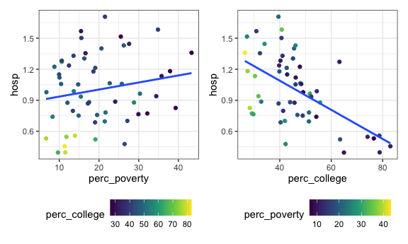

``` r
# A note for later: maybe try size instead of color?
# Example here
nyc_puma_summary_counties %>% 
  ggplot(aes(x = median_household_income, y = covid_death_rate)) + 
  geom_point(aes(size = perc_college))
```


#### Analyses using above/below outcomes median

We will want to do analysis on the cleaned\_data, I think.

``` r
# Function for density plot distribution for a continuous predictor, factorized by above or below median outcome rate, at the level of the interview

above_below_interview = function(predictor, outcome){
  
  a = cleaned_data %>% 
    mutate(
    above_hosp_median = as.factor(ifelse(puma_hosp_rate > median(puma_hosp_rate), 1, 0)),
    above_death_median = as.factor(ifelse(puma_death_rate > median(puma_death_rate), 1, 0)),
    above_vax_median = as.factor(ifelse(puma_vacc_rate > median(puma_vacc_rate), 1, 0))
  )
  
  if (outcome == "vax"){
    
      a %>% 
        ggplot(aes(
          x = {{predictor}}
        )) + 
        geom_density(aes(fill = above_vax_median), alpha = 0.5)
    
  } else if (outcome == "hosp") {
    
    a %>% 
        ggplot(aes(
          x = {{predictor}}
        )) + 
        geom_density(aes(fill = above_hosp_median), alpha = 0.5)
    
  } else if (outcome == "death") {
    
    a %>% 
        ggplot(aes(
          x = {{predictor}}
        )) + 
        geom_density(aes(fill = above_death_median), alpha = 0.5)
  }
}

# Test on household income and hospitalization
above_below_interview(household_income, "hosp")
```

    ## Warning: Removed 15290 rows containing non-finite values (stat_density).


``` r
# Test on household income and death
above_below_interview(household_income, "death")
```

    ## Warning: Removed 15290 rows containing non-finite values (stat_density).


``` r
# Test on household income and vax, faceted by borough
above_below_interview(household_income, "vax") +   
  facet_wrap(.~borough)
```

    ## Warning: Removed 15290 rows containing non-finite values (stat_density).


``` r
# Test on age and hospitalization, faceted by race
above_below_interview(age, "hosp") +   
  facet_wrap(.~race)
```

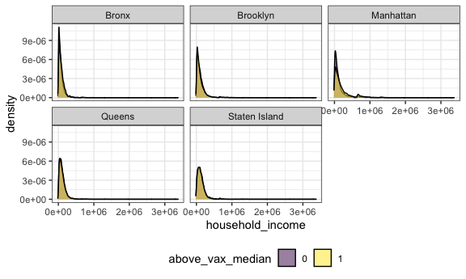

``` r
# Similar function but at the level of the PUMA (recognizing small sample sizes; maybe use bar charts?)

above_below_puma = function(predictor, outcome){
  
  a = nyc_puma_summary_counties %>% 
    mutate(
      above_hosp_median = as.factor(ifelse(covid_hosp_rate > median(covid_hosp_rate), 1, 0)),
      above_death_median = as.factor(ifelse(covid_death_rate > median(covid_death_rate), 1, 0)),
      above_vax_median = as.factor(ifelse(covid_vax_rate > median(covid_vax_rate), 1, 0)),
      above_predictor = as.factor(ifelse({{predictor}} > median({{predictor}}), 1, 0))
    )
      
  if (outcome == "vax"){
    
      one = a %>% 
        ggplot(aes(
          x = {{predictor}}
        )) + 
        geom_density(aes(fill = above_vax_median), alpha = 0.5)
    
    two = a %>% 
      ggplot(aes(
        x = above_predictor,
        fill = above_vax_median
      )) + 
      geom_bar(stat = "count")
    
   three = a %>% 
     ggplot(aes(
       x = above_predictor,
       fill = above_vax_median
     )) + 
     geom_bar(position = "fill")
   
   four = a %>% 
     ggplot(aes(x = borough, y = sum(above_vax_median == 1), fill = above_predictor)) + 
     geom_bar(position = "fill", stat = "identity")
    
    (one + two)  / (three + four)
    
  } else if (outcome == "hosp") {
    
    one = a %>% 
        ggplot(aes(
          x = {{predictor}}
        )) + 
        geom_density(aes(fill = above_hosp_median), alpha = 0.5)
    
    two = a %>% 
      ggplot(aes(
        x = above_predictor,
        fill = above_hosp_median
      )) + 
      geom_bar(stat = "count")
    
   three = a %>% 
     ggplot(aes(
       x = above_predictor,
       fill = above_hosp_median
     )) + 
     geom_bar(position = "fill")
   
   four = a %>% 
     ggplot(aes(x = borough, y = sum(above_hosp_median == 1), fill = above_predictor)) + 
     geom_bar(position = "fill", stat = "identity")
    
    (one + two)  / (three + four)
    
  } else if (outcome == "death") {
    
    one = a %>% 
        ggplot(aes(
          x = {{predictor}}
        )) + 
        geom_density(aes(fill = above_death_median), alpha = 0.5)
    
    two = a %>% 
      ggplot(aes(
        x = above_predictor,
        fill = above_death_median
      )) + 
      geom_bar(stat = "count")
    
   three = a %>% 
     ggplot(aes(
       x = above_predictor,
       fill = above_death_median
     )) + 
     geom_bar(position = "fill")
   
   four = a %>% 
     ggplot(aes(x = borough, y = sum(above_death_median == 1), fill = above_predictor)) + 
     geom_bar(position = "fill", stat = "identity")
    
    (one + two)  / (three + four)
  }
}

# Test on household income and hospitalization
above_below_puma(median_household_income, "hosp")
```


``` r
# Test on household income and death
above_below_puma(median_household_income, "death")
```


``` r
# Test on household income and vax, faceted by borough
above_below_puma(median_household_income, "vax")
```


``` r
# Test on age and hospitalization
above_below_puma(median_age, "hosp")
```


#### Playground: please ignore

``` r
## PLAYGROUND PLEASE IGNORE
# Let's look at vaccination rate by income level in each PUMA
cleaned_data %>% 
  mutate(
    income_class = cut(household_income, breaks = 50)
  ) %>% 
  group_by(income_class, puma) %>% 
  summarize(
    num_people = sum(perwt),
    puma_vax_rate = median(puma_vacc_rate),
    people_vaxxed = num_people * puma_vax_rate / 100,
    people_not_vaxxed = num_people - people_vaxxed,
    percent_vaxxed = people_vaxxed * 100 / (people_vaxxed + people_not_vaxxed)
  ) %>% 
  ggplot(aes(x = puma, y = percent_vaxxed)) + 
  geom_point((aes(color = income_class)), position = "jitter")
```

    ## Warning: Removed 55 rows containing missing values (geom_point).

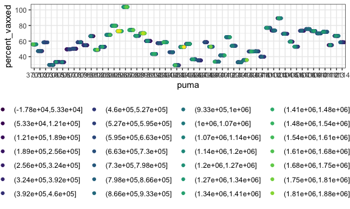

``` r
# Another cool plot
cleaned_data %>% 
  group_by(race, puma, sex, borough) %>% 
  summarize(
    num_people = sum(perwt),
    puma_vax_rate = median(puma_vacc_rate),
    people_vaxxed = num_people * puma_vax_rate / 100,
    people_not_vaxxed = num_people - people_vaxxed
  ) %>% 
  group_by(race, sex, borough) %>% 
  summarize(
    num_vaxxed = sum(people_vaxxed),
    num_not_vaxxed = sum(people_not_vaxxed),
    perc_vaxxed = num_vaxxed * 100 / (num_vaxxed + num_not_vaxxed)
  ) %>% 
  ggplot(aes(x = perc_vaxxed, y = borough, color = sex, fill = sex)) + 
  geom_boxplot(alpha = 0.3)
```


``` r
# We can write a function to look at continuous predictors against outcomes, colored by borough

borough_colored_cont = function(continuous_predictor){
  
  cleaned_data %>% 
    mutate(
      predict_class = cut({{continuous_predictor}}, breaks = 6)
    ) %>% 
    group_by(predict_class, puma, borough) %>% 
    summarize(
      num_people = sum(perwt),
      puma_vax_rate = median(puma_vacc_rate),
      num_vaxxed = num_people * puma_vax_rate / 100
    )
  
}
```
