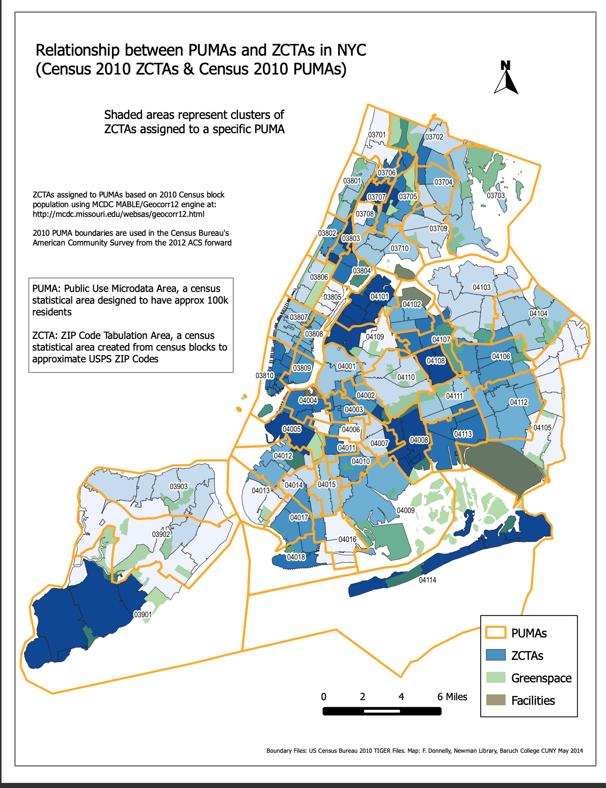

```{r}
library(tidyverse)
library(janitor)
```

Below, we read in monthly death rates and hospitalization rates due to COVID-19, as well as rates of vaccination against COVID-19, courtesy of DOHMH. Data are recorded for each Zip Code Tabulation Area (ZCTA) in NYC, and values denote rates per 100,000 residents of a given ZCTA. Next, we read in two crosswalks between geographies of NYC, courtesy of Baruch College. The `zcta_puma_cross.csv` crosswalk enables us to merge data between ZCTAs and PUMAs, neither of which is a strict sub-geography of the other.

```{r importing data sets, message = FALSE}
death_data <- read_csv("./data/nyc_death_rate_zcta.csv")
hosp_data <- read_csv("./data/nyc_hosp_rate_zcta.csv")
vacc_data <- read_csv("./data/nyc_vacc_zcta.csv")

zcta_puma_cross <- read_csv("./data/zcta_puma_cross.csv")
```

Below, we are calculating the sum of death rate and hospitalization rate for each ZCTA over the time interval from March 2020 to September 2021.

```{r cleaning death data}
death_data_clean <-
  death_data %>% 
  janitor::clean_names() %>%
  select(deathrate_10001:deathrate_11697) %>%
  pivot_longer(deathrate_10001:deathrate_11697, 
               names_to = "zcta", 
               values_to = "death_rate", 
               names_prefix = "deathrate_") %>%
  group_by(zcta) %>%
  mutate(death_rate = replace_na(death_rate, 0)) %>% 
  summarise(death_rate_sum = 
              sum(death_rate))

rm(death_data)
```

```{r cleaning hospitalization data}
hosp_data_clean <- 
  hosp_data %>% 
  janitor::clean_names() %>%
  select(hosprate_10001:hosprate_11697) %>%
  pivot_longer(hosprate_10001:hosprate_11697, 
               names_to = "zcta", 
               values_to = "hosp_rate", 
               names_prefix = "hosprate_") %>%
  group_by(zcta) %>%
  mutate(hosp_rate = replace_na(hosp_rate, 0)) %>% 
  summarise(hosp_rate_sum = 
              sum(hosp_rate))

rm(hosp_data)
```

Below, we clean `vacc_data` and extract only the percentage of partially or fully vaccinated individuals in each ZCTA as of November 16, 2021.
```{r cleaning vaccination data}
vacc_data_clean <- 
  vacc_data %>% 
  janitor::clean_names() %>% 
  select(modzcta, perc_1plus) %>% # We can make changes here if we want to include other variables
  rename(zcta = modzcta) %>% 
  mutate(zcta = as.character(zcta))

rm(vacc_data)
```

The cleaned and merged data sets:
```{r showing cleaned data sets}
#hospitalization data 
merged_outcomes <- 
  merge(death_data_clean, hosp_data_clean, by = "zcta")

#vaccination data 
merged_outcomes <- 
  merge(merged_outcomes, vacc_data_clean, by = "zcta")

head(merged_outcomes) # One potential issue here is that vaccination rate exceeds 100% in some places
```

Below, the code shows the ZCTA and PUMA ID numbers, `per_in_puma` - the percentage of the ZCTA in the associated PUMA,  and `per_of_puma` - the percentage of the PUMA that is occupied by the specified ZCTA. 
```{r cleaning ZCTA - PUMA crosswalk}
zcta_puma_clean <-
  zcta_puma_cross %>% 
  mutate(zcta10 = 
           as.character(zcta10)) %>%
  select(zcta10 , puma10, per_in_puma, per_of_puma) %>%
  rename(zcta = zcta10) 

head(zcta_puma_clean)
rm(zcta_puma_cross)
```

Below, we calculate `weighted_death_rate`, `weighted_hosp_rate`, and `weighted_vacc_rate` for each PUMA by the following steps. 

  1. The outcome rate from each ZCTA is multiplied by the percentage of the ZCTA that is in the corresponding PUMA (`per_in_puma`).
  
  2. The resulting product is then multiplied by `per_in_puma` which represents the percentage of the total PUMA that the specified ZCTA occupies.
  
  3. The resulting weighted products are summed for each PUMA to obtain the total `weighted_death_rate`, `weighted_hosp_rate`, and `weighted_vacc_rate` for each PUMA.




```{r calculating PUMA rates}
outcome_puma <- 
  merge(zcta_puma_clean, merged_outcomes, by = "zcta") %>%
  mutate(weighted_death_rate =  
           death_rate_sum * per_in_puma * per_of_puma,
         weighted_hosp_rate =
           hosp_rate_sum * per_in_puma * per_of_puma,
         weighted_vacc_rate = 
           perc_1plus * per_in_puma * per_of_puma) %>% 
  select(weighted_death_rate,
         weighted_hosp_rate,
         weighted_vacc_rate,
         puma10) %>%
  group_by(puma10) %>%
  summarise(puma_death_rate = sum(weighted_death_rate),
            puma_hosp_rate = sum(weighted_hosp_rate),
            puma_vacc_per = sum(weighted_vacc_rate)) 
  
outcome_puma %>% pull(puma10) %>% n_distinct() # merged result has the same number of puma as that of original number!

head(outcome_puma)

write_csv(outcome_puma, "./data/outcome_puma.csv")
```

This gives us the `hosp_rate` and `death_rate` per 100,000 people in each PUMA and the percentage of individuals who are partially or fully vaccinated in each PUMA.
