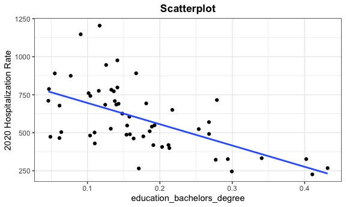
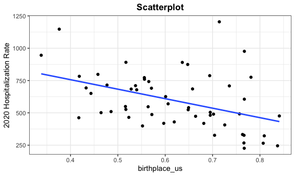
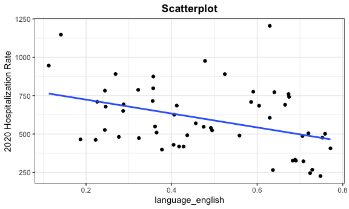

Linear Regression
================
Hun
12/5/2021

# Modeling

``` r
# set knitr defaults
knitr::opts_chunk$set(
    echo      = TRUE
  , message   = FALSE
  , fig.width = 6
  , fig.asp   = .6
  , out.width = "90%"
)
# set theme defaults
theme_set(
  theme_bw() +
  theme(
    legend.position = "bottom"
    , plot.title    = element_text(hjust = 0.5)
    , plot.subtitle = element_text(hjust = 0.5)    
    , plot.caption  = element_text(hjust = 0.0)
  )
)
# set color scale defaults
options(
    ggplot2.continuous.colour = "viridis"
  , ggplot2.continuous.fill   = "viridis"
)
scale_colour_discrete = scale_colour_viridis_d
scale_fill_discrete   = scale_fill_viridis_d
```

``` r
outcome_by_year <- 
  read_csv("./modeling/outcome_puma_by_year.csv") %>%
  rename(puma = puma10)
unbiased_data <- read_csv("./modeling/unbiased_group_means.csv") %>%
  merge(outcome_by_year, by = "puma")
```

## Correlation between predictors and 2020 hospitalizaiton rate (outcome variable)

``` r
unbiased_data %>% 
  select(-puma_death_rate_2020, -puma_hosp_rate_2021, 
         -puma_death_rate_2021, -puma_vacc_per,
         -puma, -group_pop) %>%
  cor_mat() %>%
  cor_gather() %>%
  filter(var1 %in% "puma_hosp_rate_2020") %>%
  filter(!var2 %in% "puma_hosp_rate_2020") %>%
  mutate(
    sig_p = ifelse(p < 0.01, T, F),
    cor_if_sig = ifelse(p < 0.01, cor, NA)
    ) %>% 
  ggplot(aes(
    x = var1, 
    y = var2, 
    fill = cor,
    label = round(cor_if_sig, 2))) + 
  geom_tile(color = "white") +   
  geom_text(
    color = "white",
    size = 4
  ) + 
  scale_x_discrete(
    labels = c("Birth Weight")
  ) + 
  labs(
    x = "Outcome Variable",
    y = "Predictor Variables",
    title = "Correlation Matrix between Predictors and Outcome",
    subtitle = "significant predictors at significance level 0.01",
    fill = "Correlation"
  )
```

    ## Warning: Removed 17 rows containing missing values (geom_text).


``` r
selected_variables <-
  unbiased_data %>%
  select(language_spanish, education_bachelors_degree,
             birthplace_us, health_insurance_public, language_english,
             personal_income, employment_not_in_labor_force)
```

## Scatterplot (predictors used in the model against 2020 hosp rate)

``` r
selected_variables <- 
  selected_variables %>%
  colnames() %>%
  as.vector() %>%
  as.list() 
for (i in selected_variables) {
  plot <-
  ggplot(unbiased_data, aes_string(i,  "puma_hosp_rate_2020")) + 
  geom_point() +
  geom_smooth(method = lm, se = FALSE) +
  labs(title = "Scatterplot", y = "2020 Hospitalization Rate") +
  theme(plot.title = element_text(hjust = 0.5, face = "bold"))
  
  print(plot) 
}
```



# 2020 Hosp Model

``` r
best_model <- lm(puma_hosp_rate_2020  ~ language_spanish + 
                   education_bachelors_degree +
                   birthplace_us + health_insurance_public + language_english + 
                   personal_income + employment_not_in_labor_force +
                   health_insurance_public:personal_income +
                   education_bachelors_degree:personal_income +
                   language_english:birthplace_us, data = unbiased_data)
full_model <-  lm(puma_hosp_rate_2020  ~ 
                   (language_spanish + 
                   education_bachelors_degree +
                   birthplace_us + health_insurance_public + language_english + 
                   personal_income + employment_not_in_labor_force)^2, 
                  data = unbiased_data)
```

``` r
summary(best_model)
```

    ## 
    ## Call:
    ## lm(formula = puma_hosp_rate_2020 ~ language_spanish + education_bachelors_degree + 
    ##     birthplace_us + health_insurance_public + language_english + 
    ##     personal_income + employment_not_in_labor_force + health_insurance_public:personal_income + 
    ##     education_bachelors_degree:personal_income + language_english:birthplace_us, 
    ##     data = unbiased_data)
    ## 
    ## Residuals:
    ##     Min      1Q  Median      3Q     Max 
    ## -273.74  -86.29  -17.61   79.72  387.20 
    ## 
    ## Coefficients:
    ##                                              Estimate Std. Error t value
    ## (Intercept)                                 2.202e+02  6.178e+02   0.356
    ## language_spanish                            1.446e+03  2.826e+02   5.119
    ## education_bachelors_degree                 -1.386e+03  1.204e+03  -1.151
    ## birthplace_us                              -2.324e+03  5.508e+02  -4.220
    ## health_insurance_public                    -3.614e+03  7.600e+02  -4.755
    ## language_english                           -3.652e+02  5.388e+02  -0.678
    ## personal_income                            -2.664e-02  8.044e-03  -3.312
    ## employment_not_in_labor_force               4.345e+03  9.564e+02   4.543
    ## health_insurance_public:personal_income     8.120e-02  1.923e-02   4.223
    ## education_bachelors_degree:personal_income  5.544e-02  1.867e-02   2.970
    ## birthplace_us:language_english              2.145e+03  9.076e+02   2.364
    ##                                            Pr(>|t|)    
    ## (Intercept)                                0.723207    
    ## language_spanish                           6.50e-06 ***
    ## education_bachelors_degree                 0.255940    
    ## birthplace_us                              0.000120 ***
    ## health_insurance_public                    2.15e-05 ***
    ## language_english                           0.501417    
    ## personal_income                            0.001860 ** 
    ## employment_not_in_labor_force              4.29e-05 ***
    ## health_insurance_public:personal_income    0.000119 ***
    ## education_bachelors_degree:personal_income 0.004813 ** 
    ## birthplace_us:language_english             0.022577 *  
    ## ---
    ## Signif. codes:  0 '***' 0.001 '**' 0.01 '*' 0.05 '.' 0.1 ' ' 1
    ## 
    ## Residual standard error: 139.5 on 44 degrees of freedom
    ## Multiple R-squared:  0.669,  Adjusted R-squared:  0.5938 
    ## F-statistic: 8.895 on 10 and 44 DF,  p-value: 8.903e-08

## Best Model Estimates Summary

``` r
summary(best_model) %>%
  broom::tidy()
```

    ## # A tibble: 11 × 5
    ##    term                                   estimate std.error statistic   p.value
    ##    <chr>                                     <dbl>     <dbl>     <dbl>     <dbl>
    ##  1 (Intercept)                            220.       6.18e+2     0.356   7.23e-1
    ##  2 language_spanish                      1446.       2.83e+2     5.12    6.50e-6
    ##  3 education_bachelors_degree           -1386.       1.20e+3    -1.15    2.56e-1
    ##  4 birthplace_us                        -2324.       5.51e+2    -4.22    1.20e-4
    ##  5 health_insurance_public              -3614.       7.60e+2    -4.76    2.15e-5
    ##  6 language_english                      -365.       5.39e+2    -0.678   5.01e-1
    ##  7 personal_income                         -0.0266   8.04e-3    -3.31    1.86e-3
    ##  8 employment_not_in_labor_force         4345.       9.56e+2     4.54    4.29e-5
    ##  9 health_insurance_public:personal_in…     0.0812   1.92e-2     4.22    1.19e-4
    ## 10 education_bachelors_degree:personal…     0.0554   1.87e-2     2.97    4.81e-3
    ## 11 birthplace_us:language_english        2145.       9.08e+2     2.36    2.26e-2

## Comparing Best model vs Full model summaries

``` r
summary(best_model) %>% 
  broom::glance() %>%
  bind_rows(summary(full_model) %>% broom::glance()) %>%
  mutate(model = c("Best Model", "Full Model")) %>%
  relocate(model)
```

    ## # A tibble: 2 × 9
    ##   model  r.squared adj.r.squared sigma statistic p.value    df df.residual  nobs
    ##   <chr>      <dbl>         <dbl> <dbl>     <dbl>   <dbl> <dbl>       <int> <dbl>
    ## 1 Best …     0.669         0.594  140.      8.89 8.90e-8    10          44    55
    ## 2 Full …     0.798         0.580  142.      3.66 6.78e-4    28          26    55

## Checking assumptions for linear regression

``` r
lm_spec <- linear_reg() %>%
  set_mode("regression") %>%
  set_engine("lm")
best_model_tidy <- fit(lm_spec, puma_hosp_rate_2020  ~language_spanish + 
                   education_bachelors_degree +
                   birthplace_us + health_insurance_public + language_english + 
                   personal_income + employment_not_in_labor_force +
                   health_insurance_public:personal_income +
                   education_bachelors_degree:personal_income +
                   language_english:birthplace_us,data = unbiased_data)
check_model(best_model_tidy, 
            check = c("linearity", "qq", "normality", "outliers", "homogeneity"))
```


## Mallow CP

``` r
Cp <- ols_mallows_cp(best_model, full_model)
names(Cp) <- c("Mallows' Cp")
Cp
```

    ## Mallows' Cp 
    ##    9.525754
