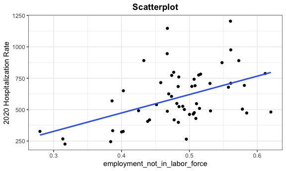
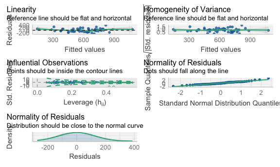

Linear Regression
================
Hun
12/5/2021

# Modeling

``` r
# set knitr defaults
knitr::opts_chunk$set(
    echo      = TRUE
  , message   = FALSE
  , fig.width = 6
  , fig.asp   = .6
  , out.width = "90%"
)
# set theme defaults
theme_set(
  theme_bw() +
  theme(
    legend.position = "bottom"
    , plot.title    = element_text(hjust = 0.5)
    , plot.subtitle = element_text(hjust = 0.5)    
    , plot.caption  = element_text(hjust = 0.0)
  )
)
# set color scale defaults
options(
    ggplot2.continuous.colour = "viridis"
  , ggplot2.continuous.fill   = "viridis"
)
scale_colour_discrete = scale_colour_viridis_d
scale_fill_discrete   = scale_fill_viridis_d
```

``` r
nyc_hh_summary <- read_csv("./modeling/data_for_regression.csv")

outcome_by_year <- 
  read_csv("./modeling/outcome_puma_by_year.csv") %>%
  rename(puma = puma10)

unbiased_data <- read_csv("./modeling/unbiased_group_means.csv") %>%
  merge(outcome_by_year, by = "puma")
```

## Correlation between predictors and 2020 hospitalizaiton rate (outcome variable)

``` r
unbiased_data %>% 
  select(-puma_death_rate_2020, -puma_hosp_rate_2021, 
         -puma_death_rate_2021, -puma_vacc_per,
         -puma, -group_pop) %>%
  cor_mat() %>%
  cor_gather() %>%
  filter(var1 %in% "puma_hosp_rate_2020") %>%
  filter(!var2 %in% "puma_hosp_rate_2020") %>%
  mutate(
    sig_p = ifelse(p < 0.01, T, F),
    cor_if_sig = ifelse(p < 0.01, cor, NA)
    ) %>% 
  ggplot(aes(
    x = var1, 
    y = var2, 
    fill = cor,
    label = round(cor_if_sig, 2))) + 
  geom_tile(color = "white") +   
  geom_text(
    color = "white",
    size = 4
  ) + 
  scale_x_discrete(
    labels = c("Birth Weight")
  ) + 
  labs(
    x = "Outcome Variable",
    y = "Predictor Variables",
    title = "Correlation Matrix between Predictors and Outcome",
    subtitle = "significant predictors at significance level 0.01",
    fill = "Correlation"
  )
```

    ## Warning: Removed 17 rows containing missing values (geom_text).


``` r
selected_variables <-
  unbiased_data %>%
  select(language_spanish, education_bachelors_degree,
             birthplace_us, health_insurance_public, language_english,
             personal_income, employment_not_in_labor_force)
```

## Scatterplot (predictors used in the model against 2020 hosp rate)

``` r
selected_variables <- 
  selected_variables %>%
  colnames() %>%
  as.vector() %>%
  as.list() 

for (i in selected_variables) {
  plot <-
  ggplot(unbiased_data, aes_string(i,  "puma_hosp_rate_2020")) + 
  geom_point() +
  geom_smooth(method = lm, se = FALSE) +
  labs(title = "Scatterplot", y = "2020 Hospitalization Rate") +
  theme(plot.title = element_text(hjust = 0.5, face = "bold"))
  
  print(plot) 
}
```



# 2020 Hosp Model

``` r
best_model <- lm(puma_hosp_rate_2020  ~ language_spanish + 
                   education_bachelors_degree +
                   birthplace_us + health_insurance_public + language_english + 
                   personal_income + employment_not_in_labor_force +
                   health_insurance_public:personal_income +
                   education_bachelors_degree:employment_not_in_labor_force +
                   language_english:birthplace_us, data = unbiased_data)

full_model <-  lm(puma_hosp_rate_2020  ~ 
                    (language_spanish + education_bachelors_degree +
                     birthplace_us + health_insurance_public + language_english + 
                     personal_income + employment_not_in_labor_force)^2, 
                     data = unbiased_data)
```

## Best Model Estimates Summary

``` r
summary(best_model) %>%
  broom::tidy()
```

    ## # A tibble: 11 × 5
    ##    term                                    estimate std.error statistic  p.value
    ##    <chr>                                      <dbl>     <dbl>     <dbl>    <dbl>
    ##  1 (Intercept)                             -1.57e+3   6.17e+2    -2.54   1.45e-2
    ##  2 language_spanish                         1.58e+3   2.81e+2     5.62   1.22e-6
    ##  3 education_bachelors_degree               7.73e+3   2.11e+3     3.67   6.47e-4
    ##  4 birthplace_us                           -2.78e+3   5.71e+2    -4.86   1.52e-5
    ##  5 health_insurance_public                 -3.20e+3   5.94e+2    -5.39   2.60e-6
    ##  6 language_english                        -3.56e+2   5.22e+2    -0.683  4.98e-1
    ##  7 personal_income                         -9.73e-3   2.61e-3    -3.72   5.60e-4
    ##  8 employment_not_in_labor_force            7.01e+3   1.34e+3     5.24   4.35e-6
    ##  9 health_insurance_public:personal_in…     6.93e-2   1.49e-2     4.66   2.91e-5
    ## 10 education_bachelors_degree:employme…    -1.43e+4   4.18e+3    -3.41   1.39e-3
    ## 11 birthplace_us:language_english           2.41e+3   8.99e+2     2.68   1.02e-2

## Comparing Best model vs Full model summaries

``` r
summary(best_model) %>% 
  broom::glance() %>%
  bind_rows(summary(full_model) %>% broom::glance()) %>%
  mutate(model = c("Best Model", "Full Model")) %>%
  relocate(model)
```

    ## # A tibble: 2 × 9
    ##   model  r.squared adj.r.squared sigma statistic p.value    df df.residual  nobs
    ##   <chr>      <dbl>         <dbl> <dbl>     <dbl>   <dbl> <dbl>       <int> <dbl>
    ## 1 Best …     0.686         0.615  136.      9.61 3.09e-8    10          44    55
    ## 2 Full …     0.798         0.580  142.      3.66 6.78e-4    28          26    55

## Mallow CP

``` r
ols_mallows_cp(best_model, full_model)
```

    ## [1] 7.359837

## Checking assumptions for linear regression

``` r
lm_spec <- linear_reg() %>%
  set_mode("regression") %>%
  set_engine("lm")

best_model <- fit(lm_spec, puma_hosp_rate_2020  ~ language_spanish + education_bachelors_degree +
             birthplace_us + health_insurance_public + language_english + 
             personal_income + employment_not_in_labor_force +
             health_insurance_public:personal_income +
             education_bachelors_degree:employment_not_in_labor_force +
             language_english:birthplace_us,
                data = unbiased_data)


check_model(best_model, 
            check = c("linearity", "qq", "normality", "outliers", "homogeneity"))
```


