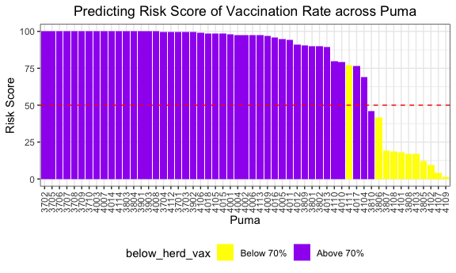

Risk Scores and Clustering
================
Zachary Katz and Hun Lee
12/6/2021

``` r
jimzip <- function(csv_file, path) {
  # create full path to csv file
  full_csv <- paste0(path, "/", csv_file)
  # append ".zip" to csv file
  zip_file <- paste0(full_csv, ".zip")
  # unzip file
  unzip(zip_file)
  # read csv
  data_extract <- read_csv(csv_file)
  # be sure to remove file once unzipped (it will live in working directory)
  on.exit(file.remove(csv_file))
  # output data
  data_extract
}

census_data <- jimzip("census_filtered.csv", "./data")
```

``` r
health_data <- read_csv("./data/outcome_puma.csv")

merged_data <- merge(census_data, health_data, by = "puma")
rm(census_data, health_data)
```

``` r
# Clean the merged census and outcomes data
cleaned_data = 
  merged_data %>% 
  # Remove variables less useful for analysis, including ones with high correlation with remaining variables
  select(-multyear, -ancestr1, -ancestr2, -labforce, -occ, -ind, -incwage, -occscore, -pwpuma00, -ftotinc, -hcovpub) %>% 
  # Remove duplicate rows
  distinct() %>% 
  # Rename variables
  rename(
    borough = countyfip,
    has_broadband = cihispeed,
    birthplace = bpl,
    education = educd,
    employment = empstat,
    personal_income = inctot,
    work_transport = tranwork,
    household_income = hhincome,
    on_foodstamps = foodstmp,
    family_size = famsize,
    num_children = nchild,
    US_citizen = citizen,
    puma_vacc_rate = puma_vacc_per,
    on_welfare = incwelfr,
    poverty_threshold = poverty
  ) %>% 
  # Recode variables according to data dictionary
  mutate(
    # Researched mapping for county
    borough = recode(
      borough,
      "5" = "Bronx",
      "47" = "Brooklyn",
      "61" = "Manhattan",
      "81" = "Queens",
      "85" = "Staten Island"
    ),
    rent = ifelse(
      rent == 9999, 0,
      rent
    ),
    household_income = ifelse(
      household_income %in% c(9999998,9999999), NA,
      household_income
    ),
    on_foodstamps = recode(
      on_foodstamps,
      "1" = "No",
      "2" = "Yes"
    ),
    has_broadband = case_when(
      has_broadband == "20" ~ "No",
      has_broadband != "20" ~ "Yes"
    ),
    sex = recode(
      sex,
      "1" = "Male",
      "2" = "Female"
    ),
    # Collapse Hispanic observation into race observation
    race = case_when(
      race == "1" ~ "White",
      race == "2" ~ "Black",
      race == "3" ~ "American Indian",
      race %in% c(4,5,6) ~ "Asian and Pacific Islander",
      race == 7 & hispan %in% c(1,2,3,4) ~ "Hispanic",
      race == 7 & hispan %in% c(0,9) ~ "Other",
      race %in% c(8,9) ~ "2+ races"
    ),
    birthplace = case_when(
      birthplace %in% 1:120 ~"US",
      birthplace %in% 121:950 ~ "Non-US",
      birthplace == 999 ~"Unknown"
    ),
    US_citizen = case_when(
      US_citizen %in% c(1,2) ~ "Yes",
      US_citizen %in% 3:8 ~"No",
      US_citizen %in% c(0,9) ~ "Unknown"
    ),
    # Chose languages based on highest frequency observed
    language = case_when(
      language == "1" ~ "English",
      language == "12" ~ "Spanish",
      language == "43" ~ "Chinese",
      language == "0" ~ "Unknown",
      language == "31" ~ "Hindi",
      !language %in% c(1,12,43,0,31) ~ "Other"
    ),
    # Collapse multiple health insurance variables into single variable
    health_insurance = case_when(
      hcovany == 1 ~ "None",
      hcovany == 2 & hcovpriv == 2 ~ "Private",
      hcovany == 2 & hcovpriv == 1 ~ "Public"
    ),
    education = case_when(
      education %in% 2:61 ~ "Less Than HS Graduate",
      education %in% 62:64 ~ "HS Graduate",
      education %in% 65:100 ~ "Some College",
      education %in% 110:113 ~ "Some College",
      education == 101 ~ "Bachelor's Degree",
      education %in% 114:116 ~ "Post-Graduate Degree",
      education %in% c(0,1,999) ~ "Unknown"
    ),
    employment = case_when(
      employment %in% c(0,3) ~ "Not in labor force",
      employment == 1 ~ "Employed",
      employment == 2 ~ "Unemployed"
    ),
    personal_income = ifelse(
      personal_income %in% c(9999998,9999999), NA,
      personal_income
    ),
    household_income = ifelse(
      household_income %in% c(9999998,9999999), NA,
      household_income
    ),
    on_welfare = case_when(
      on_welfare > 0 ~ "Yes",
      on_welfare == 0 ~ "No"
    ), 
    poverty_threshold = case_when(
      poverty_threshold >= 100 ~ "Above",
      poverty_threshold < 100 ~ "Below"
    ),
    work_transport = case_when(
      work_transport %in% c(31:37, 39) ~ "Public Transit",
      work_transport %in% c(10:20, 38) ~ "Private Vehicle",
      work_transport == 50 ~ "Bicycle",
      work_transport == 60 ~ "Walking",
      work_transport == 80 ~ "Worked From Home",
      work_transport %in% c(0, 70) ~ "Other"
    )
  ) %>% 
  # Convert hospitalization and death rates to pure percentages to match vax rate
  mutate(
    puma_hosp_rate = puma_hosp_rate / 1000,
    puma_death_rate = puma_death_rate / 1000
  ) %>% 
  # Eliminate columns no longer needed after transformation
  select(-hispan, -hcovany, -hcovpriv) %>% 
  # Relocate new columns
  relocate(health_insurance, .before = personal_income) %>% 
  relocate(poverty_threshold, .before = work_transport) %>% 
  relocate(on_welfare, .before = poverty_threshold) %>% 
  relocate(perwt, .before = cluster) %>% 
  # Create factor variables where applicable
  mutate(across(.cols = c(puma, borough, on_foodstamps, has_broadband, sex, race, birthplace, US_citizen, language, health_insurance, education, employment, on_welfare, poverty_threshold, work_transport), as.factor)) %>% 
  # Change levels of certain key factors for later analysis
  mutate(
    health_insurance = factor(health_insurance,
                              levels = c("None", "Public", "Private")),
    education = factor(education,
                       levels = c("Less Than HS Graduate", "HS Graduate", "Some College", "Bachelor's Degree", "Post-Graduate Degree", "Unknown"))
  )

rm(merged_data)
```

``` r
# Example data frame with weightings for summary stats over each PUMA
nyc_puma_summary = cleaned_data %>% 
  # Note: do we need to filter to one individual per household for household weightings?
  group_by(puma) %>%
  summarize(
    total_people = sum(perwt),
    median_household_income = weighted.median(household_income, hhwt, na.rm = TRUE),
    perc_foodstamps = sum(hhwt[on_foodstamps == "Yes"]) * 100 / sum(hhwt),
    perc_broadband = sum(hhwt[has_broadband == "Yes"]) * 100 / sum(hhwt),
    perc_male = sum(perwt[sex == "Male"]) * 100 / sum(perwt),
    median_age = weighted.median(age, perwt, na.rm = TRUE),
    perc_white = sum(perwt[race == "White"]) * 100 / sum(perwt),
    perc_foreign_born = sum(perwt[birthplace == "Non-US"]) * 100 / sum(perwt),
    perc_citizen = sum(perwt[US_citizen == "Yes"]) * 100 / sum(perwt),
    perc_english = sum(perwt[language == "English"]) * 100 / sum(perwt),
    perc_college = sum(perwt[education %in% c("Some College", "Bachelor's Degree", "Post-Graduate Degree")]) * 100 / sum(perwt),
    perc_unemployed = sum(perwt[employment == "Unemployed"]) * 100 / sum(perwt),
    perc_insured = sum(perwt[health_insurance %in% c("Private", "Public")]) * 100 / sum(perwt),
    median_personal_income = weighted.median(personal_income, perwt, na.rm = TRUE),
    perc_welfare = sum(perwt[on_welfare == "Yes"]) * 100 / sum(perwt),
    perc_poverty = sum(perwt[poverty_threshold == "Below"]) * 100 / sum(perwt),
    perc_public_transit = sum(perwt[work_transport == "Public Transit"]) * 100 / sum(perwt),
    covid_hosp_rate = median(puma_hosp_rate),
    covid_vax_rate = median(puma_vacc_rate),
    covid_death_rate = median(puma_death_rate)
  )
```

## Prediction Modeling

### Risk Scoring

We want to develop a method to score PUMAs on risk of not achieving herd
immunity from vaccination. Let’s say that herd immunity occurs at 70%
vaccination rate, for our purposes.

``` r
# 1 indicates BELOW 70% vaccination rate
logistic_df = nyc_puma_summary %>% 
  mutate(
    below_herd_vax = as.factor(ifelse(covid_vax_rate >= 70, 0, 1))
  ) %>% 
  select(-puma, -total_people, -covid_hosp_rate, -covid_death_rate, -covid_vax_rate)

# Define predictors matrix
x = model.matrix(below_herd_vax ~ ., logistic_df)[,-1]

# Define outcomes
y = logistic_df$below_herd_vax
```

``` r
library(caret) # Note: new libraries are loaded here due to potential function masking from the `caret` library
library(mlbench)
```

## Repeated Cross Validation

``` r
set.seed(777)
vax_cv <- trainControl(method = "repeatedcv", number = 5, repeats = 100, 
                       savePredictions = T
                       )

# Goal is to find optimal lambda
lasso_model <- train(below_herd_vax ~ ., data = logistic_df,
                     method = "glmnet",
                     trControl = vax_cv,
                     tuneGrid = expand.grid(
                       .alpha = 1,
                       .lambda = seq(0.0001, 1, length = 100)),
                     family = "binomial")

lasso_model
```

    ## glmnet 
    ## 
    ## 55 samples
    ## 16 predictors
    ##  2 classes: '0', '1' 
    ## 
    ## No pre-processing
    ## Resampling: Cross-Validated (5 fold, repeated 100 times) 
    ## Summary of sample sizes: 44, 44, 44, 44, 44, 44, ... 
    ## Resampling results across tuning parameters:
    ## 
    ##   lambda  Accuracy   Kappa        
    ##   0.0001  0.8353667   0.5096925018
    ##   0.0102  0.8864485   0.6093962831
    ##   0.0203  0.8815030   0.5605606462
    ##   0.0304  0.8755576   0.5151147647
    ##   0.0405  0.8642970   0.4441862115
    ##   0.0506  0.8472061   0.3500473463
    ##   0.0607  0.8278273   0.2375886941
    ##   0.0708  0.8106000   0.1354709024
    ##   0.0809  0.7995394   0.0689040837
    ##   0.0910  0.7957758   0.0395333694
    ##   0.1011  0.7935727   0.0196021570
    ##   0.1112  0.7932697   0.0089344023
    ##   0.1213  0.7938606   0.0008179452
    ##   0.1314  0.7956364  -0.0015992933
    ##   0.1415  0.7954879  -0.0066111743
    ##   0.1516  0.7990818  -0.0008349543
    ##   0.1617  0.7996455  -0.0017188329
    ##   0.1718  0.8003909  -0.0005835544
    ##   0.1819  0.8007727   0.0000000000
    ##   0.1920  0.8007727   0.0000000000
    ##   0.2021  0.8007727   0.0000000000
    ##   0.2122  0.8007727   0.0000000000
    ##   0.2223  0.8007727   0.0000000000
    ##   0.2324  0.8007727   0.0000000000
    ##   0.2425  0.8007727   0.0000000000
    ##   0.2526  0.8007727   0.0000000000
    ##   0.2627  0.8007727   0.0000000000
    ##   0.2728  0.8007727   0.0000000000
    ##   0.2829  0.8007727   0.0000000000
    ##   0.2930  0.8007727   0.0000000000
    ##   0.3031  0.8007727   0.0000000000
    ##   0.3132  0.8007727   0.0000000000
    ##   0.3233  0.8007727   0.0000000000
    ##   0.3334  0.8007727   0.0000000000
    ##   0.3435  0.8007727   0.0000000000
    ##   0.3536  0.8007727   0.0000000000
    ##   0.3637  0.8007727   0.0000000000
    ##   0.3738  0.8007727   0.0000000000
    ##   0.3839  0.8007727   0.0000000000
    ##   0.3940  0.8007727   0.0000000000
    ##   0.4041  0.8007727   0.0000000000
    ##   0.4142  0.8007727   0.0000000000
    ##   0.4243  0.8007727   0.0000000000
    ##   0.4344  0.8007727   0.0000000000
    ##   0.4445  0.8007727   0.0000000000
    ##   0.4546  0.8007727   0.0000000000
    ##   0.4647  0.8007727   0.0000000000
    ##   0.4748  0.8007727   0.0000000000
    ##   0.4849  0.8007727   0.0000000000
    ##   0.4950  0.8007727   0.0000000000
    ##   0.5051  0.8007727   0.0000000000
    ##   0.5152  0.8007727   0.0000000000
    ##   0.5253  0.8007727   0.0000000000
    ##   0.5354  0.8007727   0.0000000000
    ##   0.5455  0.8007727   0.0000000000
    ##   0.5556  0.8007727   0.0000000000
    ##   0.5657  0.8007727   0.0000000000
    ##   0.5758  0.8007727   0.0000000000
    ##   0.5859  0.8007727   0.0000000000
    ##   0.5960  0.8007727   0.0000000000
    ##   0.6061  0.8007727   0.0000000000
    ##   0.6162  0.8007727   0.0000000000
    ##   0.6263  0.8007727   0.0000000000
    ##   0.6364  0.8007727   0.0000000000
    ##   0.6465  0.8007727   0.0000000000
    ##   0.6566  0.8007727   0.0000000000
    ##   0.6667  0.8007727   0.0000000000
    ##   0.6768  0.8007727   0.0000000000
    ##   0.6869  0.8007727   0.0000000000
    ##   0.6970  0.8007727   0.0000000000
    ##   0.7071  0.8007727   0.0000000000
    ##   0.7172  0.8007727   0.0000000000
    ##   0.7273  0.8007727   0.0000000000
    ##   0.7374  0.8007727   0.0000000000
    ##   0.7475  0.8007727   0.0000000000
    ##   0.7576  0.8007727   0.0000000000
    ##   0.7677  0.8007727   0.0000000000
    ##   0.7778  0.8007727   0.0000000000
    ##   0.7879  0.8007727   0.0000000000
    ##   0.7980  0.8007727   0.0000000000
    ##   0.8081  0.8007727   0.0000000000
    ##   0.8182  0.8007727   0.0000000000
    ##   0.8283  0.8007727   0.0000000000
    ##   0.8384  0.8007727   0.0000000000
    ##   0.8485  0.8007727   0.0000000000
    ##   0.8586  0.8007727   0.0000000000
    ##   0.8687  0.8007727   0.0000000000
    ##   0.8788  0.8007727   0.0000000000
    ##   0.8889  0.8007727   0.0000000000
    ##   0.8990  0.8007727   0.0000000000
    ##   0.9091  0.8007727   0.0000000000
    ##   0.9192  0.8007727   0.0000000000
    ##   0.9293  0.8007727   0.0000000000
    ##   0.9394  0.8007727   0.0000000000
    ##   0.9495  0.8007727   0.0000000000
    ##   0.9596  0.8007727   0.0000000000
    ##   0.9697  0.8007727   0.0000000000
    ##   0.9798  0.8007727   0.0000000000
    ##   0.9899  0.8007727   0.0000000000
    ##   1.0000  0.8007727   0.0000000000
    ## 
    ## Tuning parameter 'alpha' was held constant at a value of 1
    ## Accuracy was used to select the optimal model using the largest value.
    ## The final values used for the model were alpha = 1 and lambda = 0.0102.

## Result from training data

``` r
coef <- coef(lasso_model$finalModel, lasso_model$bestTune$lambda)

sub_lasso <-
  subset(lasso_model$pred, lasso_model$pred$lambda == lasso_model$bestTune$lambda)

caret::confusionMatrix(table(sub_lasso$pred, sub_lasso$obs))
```

    ## Confusion Matrix and Statistics
    ## 
    ##    
    ##        0    1
    ##   0  731  257
    ##   1  369 4143
    ##                                           
    ##                Accuracy : 0.8862          
    ##                  95% CI : (0.8775, 0.8945)
    ##     No Information Rate : 0.8             
    ##     P-Value [Acc > NIR] : < 2.2e-16       
    ##                                           
    ##                   Kappa : 0.6302          
    ##                                           
    ##  Mcnemar's Test P-Value : 9.145e-06       
    ##                                           
    ##             Sensitivity : 0.6645          
    ##             Specificity : 0.9416          
    ##          Pos Pred Value : 0.7399          
    ##          Neg Pred Value : 0.9182          
    ##              Prevalence : 0.2000          
    ##          Detection Rate : 0.1329          
    ##    Detection Prevalence : 0.1796          
    ##       Balanced Accuracy : 0.8031          
    ##                                           
    ##        'Positive' Class : 0               
    ## 

## The plot below shows coefficient estimates corresponding to a subset of the predictors in the dataset

``` r
#lambda <- 10^seq(-2, 3, length = 0.1)

lambda  <- seq(0.0001, 1, length = 100)

lambda_opt = lasso_model$bestTune$lambda


result_plot <- broom::tidy(lasso_model$finalModel) %>% 
select(term, lambda, estimate) %>% 
complete(term, lambda, fill = list(estimate = 0) ) %>% 
filter(term != "(Intercept)") %>% 
ggplot(aes(x = log(lambda, 10), y = estimate, group = term, color = term)) + 
geom_path() + 
geom_vline(xintercept = log(lambda_opt, 10), color = "blue", size = 1.2) +
theme(legend.position = "none")

library(plotly)
ggplotly(result_plot)
```


## Getting Risk Prediction for each puma and visualize them.

``` r
lambda <- lasso_model$bestTune$lambda
lasso_fit = glmnet(x, y, lambda = lambda, family = "binomial")
risk_predictions = (round((predict(lasso_fit, x, type = "response"))*100, 1))


puma <- nyc_puma_summary %>% 
  select(puma)

vax <- logistic_df %>% 
  select(below_herd_vax)


risk_prediction <- 
  bind_cols(puma, vax, as.vector(risk_predictions)) %>%
  rename(risk_prediciton = ...3)

risk_prediction %>%
  mutate(puma = fct_reorder(puma, risk_prediciton, .desc = TRUE)) %>%
  ggplot(aes(x = puma, y = risk_prediciton, fill = below_herd_vax)) + 
  geom_bar(stat  = "identity") + 
  geom_hline(yintercept = 50, linetype = "dashed", color = "red") +
  theme(axis.text.x = element_text(angle = 90, vjust = 0.5, hjust = 1)) +
  labs(title = "Predicting Risk Score of Vaccination Rate across Puma",
       x = "Puma", y = "Risk Score") + 
  scale_fill_manual(values = c("yellow", "purple"), labels = c("Below 70%", "Above 70%")) 
```



## Clustering

We might try to see how our PUMAs cluster on predictors, and how those
clusters are associated with distributions of particular outcomes.

Let’s start with K-means clustering.

``` r
# Define tibble of predictors only
predictors = nyc_puma_summary %>% 
  select(-puma, -total_people, -covid_hosp_rate, -covid_vax_rate, -covid_death_rate)

# Define tibble of outcomes only
outcomes = nyc_puma_summary %>% 
  select(covid_hosp_rate, covid_death_rate, covid_vax_rate)

# Define tibble of pumas only
pumas = nyc_puma_summary %>% 
  select(puma)

# Fit 3 clusters on predictors
kmeans_fit = 
  kmeans(x = predictors, centers = 3)

# Add clusters to data frame of predictors and bind with PUMA and outcomes data
predictors = 
  broom::augment(kmeans_fit, predictors)

# Bind columns
full_df = cbind(pumas, outcomes, predictors)

# Summary df
summary_df = full_df %>% 
  group_by(.cluster) %>% 
  summarize(
    median_hosp = median(covid_hosp_rate),
    median_death = median(covid_death_rate),
    median_vax = median(covid_vax_rate)
  )

# Plot predictor clusters against outcomes
# Example: try hospitalization vs vaccination
ggplot(data = full_df, aes(x = covid_hosp_rate, y = covid_vax_rate, color = .cluster)) + 
  geom_point() + 
  geom_point(data = summary_df, aes(x = median_hosp, y = median_vax), color = "black", size = 4) +
  geom_point(data = summary_df, aes(x = median_hosp, y = median_vax, color = .cluster), size = 2.75)
```


We could also scale predictors and omit NAs.

``` r
# Scale predictors
for_clustering = predictors %>% 
  select(-.cluster) %>% 
  na.omit() %>% 
  scale()

# Evaluate Euclidean distances between observations
distance = get_dist(for_clustering)
fviz_dist(distance, gradient = list(low = "#00AFBB", mid = "white", high = "#FC4E07"))
```


``` r
# Cluster with three centers
k_scaled = kmeans(for_clustering, centers = 3)

# Visualize cluster plot with reduction to two dimensions
fviz_cluster(k_scaled, data = for_clustering)
```


``` r
# Bind with outcomes and color clusters
full_df = for_clustering %>% 
  as_tibble() %>% 
  cbind(outcomes, pumas) %>% 
  mutate(
    cluster = k_scaled$cluster
  )

summary_df = full_df %>% 
  group_by(cluster) %>% 
  summarize(
    median_hosp = median(covid_hosp_rate),
    median_death = median(covid_death_rate),
    median_vax = median(covid_vax_rate)
  )

ggplot(data = full_df, aes(x = covid_hosp_rate, y = covid_vax_rate, color = factor(cluster))) + 
  geom_point() + 
  geom_point(data = summary_df, aes(x = median_hosp, y = median_vax), color = "black", size = 4) +
  geom_point(data = summary_df, aes(x = median_hosp, y = median_vax, color = factor(cluster)), size = 2.75)
```


We may want to evaluate this method’s clustering quality as follows:

``` r
# Check where elbow occurs using WSS method
fviz_nbclust(for_clustering, kmeans, method = "wss")
```


``` r
# Check for optimal number of clusters using silhouette method
fviz_nbclust(for_clustering, kmeans, method = "silhouette")
```


``` r
# Check fnumber of clusters that minimize gap statistic
gap_stat = clusGap(for_clustering, FUN = kmeans, nstart = 25, K.max = 20, B = 50)
fviz_gap_stat(gap_stat)
```


It seems that two clusters may actually work better than three, when
clustering on predictors.

``` r
# Scale predictors
for_clustering = predictors %>% 
  select(-.cluster) %>% 
  na.omit() %>% 
  scale()

# Evaluate Euclidean distances between observations
distance = get_dist(for_clustering)
fviz_dist(distance, gradient = list(low = "#00AFBB", mid = "white", high = "#FC4E07"))
```


``` r
# Cluster with three centers
k_scaled2 = kmeans(for_clustering, centers = 2)

# Visualize cluster plot with reduction to two dimensions
fviz_cluster(k_scaled2, data = for_clustering)
```


``` r
# Bind with outcomes and color clusters
full_df = for_clustering %>% 
  as_tibble() %>% 
  cbind(outcomes, pumas) %>% 
  mutate(
    cluster = k_scaled2$cluster
  )

summary_df = full_df %>% 
  group_by(cluster) %>% 
  summarize(
    median_hosp = median(covid_hosp_rate),
    median_death = median(covid_death_rate),
    median_vax = median(covid_vax_rate)
  )

ggplot(data = full_df, aes(x = covid_hosp_rate, y = covid_vax_rate, color = factor(cluster))) + 
  geom_point() + 
  geom_point(data = summary_df, aes(x = median_hosp, y = median_vax), color = "black", size = 4) +
  geom_point(data = summary_df, aes(x = median_hosp, y = median_vax, color = factor(cluster)), size = 2.75)
```


